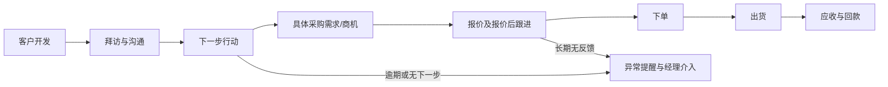
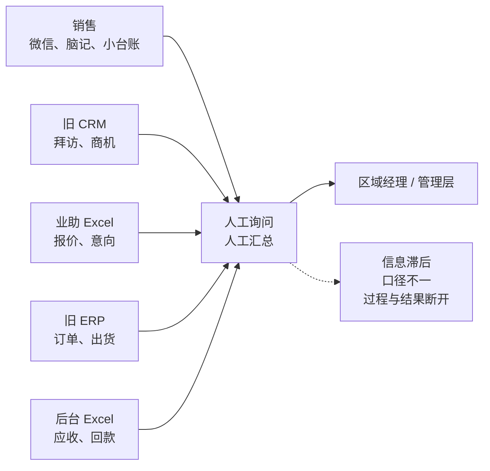
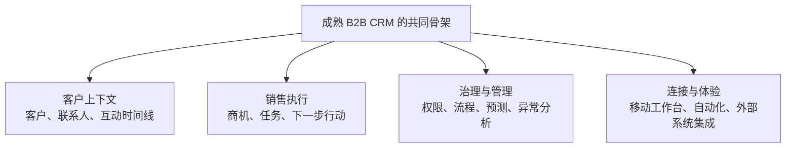
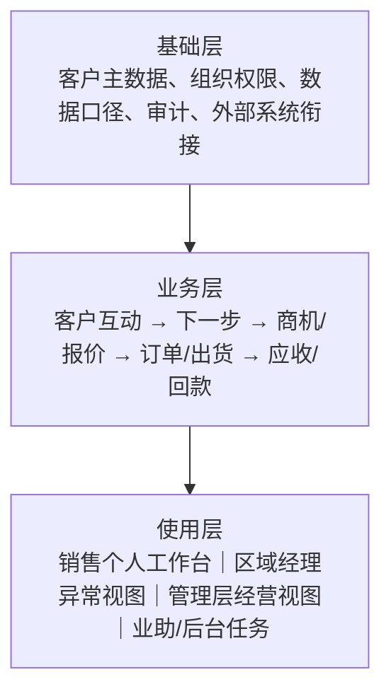
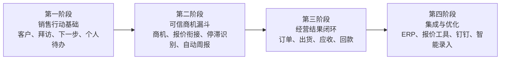

# 工业设备销售全过程 CRM 建设方案纲要

> 版本：V0.3（管理层讨论稿）
> 日期：2026 年 8 月 25 日
> 编制及实施：内部自研，现阶段由项目负责人牵头业务调研、产品设计和开发
> 本文件重点：为什么建设、建设什么、按什么节奏建设

---

## 一、核心结论

建议公司建设一套面向工业设备线下直销的销售全过程 CRM。

这套系统不应只是客户资料库、销售填报工具或管理统计报表，而应成为销售人员的日常工作系统和管理层的销售经营基础：

> 帮助销售知道今天应该跟进什么，帮助区域经理知道哪些客户和商机正在停滞，帮助管理层知道真实销售储备如何转化为订单、出货和回款。

系统总体围绕以下业务主线建设：

建设节奏上，先解决客户跟进、下一步行动和商机有效性，再衔接订单、出货和回款，最后根据实际价值深化 ERP、报价工具和钉钉等集成。

---

## 二、项目需要解决什么

### 1. 业务背景

公司主营泵浦及成套过滤设备，面向 B2B 小型离散制造业客户销售，年经营规模约 6000 万元。销售团队约 20 人，按省区开展园区陌拜、老客户维护和展会获客。典型销售周期通常为 1 个月或更长，主要经历需求沟通、报价、持续跟进、下单、出货和回款。

产品组合、价格及生产端信息较复杂，当前需要业助协助形成报价；订单、出货和实际回款由 ERP、后台或财务掌握。

当前各类信息虽然分别有载体，但主要依赖人工询问和汇总才能形成管理判断：

### 2. 三个核心问题

#### 销售行动不可见

拜访完成后通常没有形成明确下一步，销售依赖个人微信、脑记或小台账。管理层不知道销售每天在推进哪些客户，也难以及时识别遗漏、逾期和需要支持的事项。

#### 销售漏斗不可信

业助根据正式报价或口头报价在 Excel 中登记一条意向，但后续状态依赖人工向销售询问。部分报价一至两个月没有反馈仍然留在意向池中，历史报价金额、有效商机和预计成交混在一起，无法判断真实销售储备。

#### 销售过程与经营结果断开

客户、拜访、商机和报价反映销售过程；订单、出货、应收和回款反映经营结果。当前信息分散在旧 CRM、旧 ERP、个人微信和 Excel 中，销售、业助、区域经理及后台之间需要反复询问，无法围绕同一客户和采购需求形成连续链路。

### 3. 为什么不能只改进填报

现有 CRM 的主要问题不是缺少字段，而是销售填写后对本人帮助不足：客户历史不方便看、下一步无法管理、报价和回款不容易查，填完后仍可能需要写台账和周报。

如果新系统仍然以“要求销售填更多”为中心，即使增加功能，也难以获得连续、可信的数据。

---

## 三、行业调研给出的基本方向

前期已对 Salesforce、Microsoft Dynamics 365、SAP Sales Cloud、Oracle Sales、HubSpot、Zoho CRM、Pipedrive 和 Freshsales 等代表性 B2B CRM 进行了初步调研。

不同产品规模和定位不同，但成熟 CRM 长期稳定的共同骨架基本一致：

行业趋势说明，CRM 的核心正在从“保存客户资料”转向“以较低录入成本推动正确的销售行动”。这与公司当前需要解决的问题一致。

本项目应遵循这些基本方向，但不照搬大型 CRM 的全部功能。复杂 CPQ、营销自动化、合同、全量离线和 AI 等能力，只有在核心销售流程稳定且确有价值时再建设。

调研范围、共同能力、移动端趋势及其与本项目的对应关系见本文件“附录 A：行业调研摘要”，管理层无需另外阅读独立调研文件才能理解本方案。

---

## 四、CRM 应该建设成什么

整体能力分为基础、业务和使用三层。组织权限和统一数据口径支撑业务主链，各角色在同一事实基础上获得不同工作视图：

### 1. 客户经营基础

CRM首先要建立统一、可持续维护的客户和联系人基础。

需要具备：

- 客户、联系人、地区、负责人和基础分类；
- 必要的客户查重和归属控制；
- 客户历史拜访、商机、报价事实、订单和回款概况；
- 按权限查看本人、团队或全公司的客户数据；
- 客户转交后仍能保留完整经营历史。

客户是长期经营对象；商机是客户某一次具体采购需求。两者必须分开，避免一个客户名称对应一堆无法区分的报价记录。

### 2. 销售行动与下一步

移动端首先要成为销售个人工作台。销售打开系统后，应能快速看到：

- 今天需要跟进的客户；
- 已逾期的下一步行动；
- 报价后长期没有反馈的商机；
- 最近拜访的客户和上次沟通结果；
- 后续接入的订单、出货和回款提醒。

一次常规拜访记录应尽量只要求：

- 客户；
- 本次沟通结果；
- 下一步行动；
- 下一步日期。

如确实没有下一步，应说明暂无需求、等待客户、等待内部支持、项目暂停或已转其他供应商等原因。

一次记录应自动进入客户时间线、个人待办、商机进展、周报和管理视图，不再要求销售重复填写相同内容。

### 3. 商机与真实销售漏斗

商机用于持续管理一项具体采购需求。每个进行中的商机至少应回答：

1. 最近一次什么时候联系；
2. 客户最新反馈是什么；
3. 当前处于什么状态、卡在哪里；
4. 下一步由谁在什么时候完成；
5. 当前预计金额和预计下单时间；
6. 是否需要业助、技术或经理支持。

系统应区分：

| 商机状态   | 管理含义                                   |
| ---------- | ------------------------------------------ |
| 待确认     | 已发现需求或存在报价记录，但有效性尚未确认 |
| 需求沟通   | 已确认存在采购需求，正在了解方案和条件     |
| 报价准备   | 正在组织报价支持                           |
| 已报价跟进 | 已向客户报价，正在等待或推动反馈           |
| 停滞       | 超过规定时间没有有效互动或下一步已经逾期   |
| 暂停       | 预算、项目或客户原因导致暂不推进           |
| 已下单     | 已取得正式订单                             |
| 已丢失     | 已确认未成交并记录原因                     |

管理层应分别看到历史报价金额、待确认金额、有效商机金额、停滞金额、暂停/丢失金额和订单金额，不能再用累计报价金额代表有效销售预测。

### 4. 报价协同

当前业助参与报价，是由产品搭配、价格和生产端信息复杂所决定。首期不适合在 CRM 内直接建设复杂产品配置、自动定价和正式报价单生成。

CRM只需要管理报价与商机之间的必要衔接：

1. 销售基于商机提出报价支持需求；
2. 业助继续使用现有方式完成报价；
3. 报价完成后确认完成日期、最终金额等必要事实；
4. 系统自动把商机转入报价后跟进，并生成销售下一步；
5. 业助不再维护独立 Excel 意向池；
6. 报价文件是否保存于 CRM，根据后续实际查阅和交接需求确定，首期不强制上传。

报价制作本身可以在后续单独优化，但不能阻碍 CRM 先解决报价完成后的客户跟进和意向有效性问题。

### 5. 订单、出货与回款

对公司而言，下订单代表销售基本成功，出货代表确定性进一步提高，完成回款才形成完整经营结果。

CRM总体上需要呈现：

- 订单日期、金额和编号；
- 出货状态和日期；
- 合同付款安排对应的应收节点；
- 每个节点的计划金额、到期日、实收金额和状态；
- 即将到期和已经逾期的回款；
- 责任销售、区域经理和后台需要处理的事项。

十多种付款方式可以统一拆成若干应收节点，例如预付款、发货款、验收款和尾款，不需要为每种合同开发一套独立流程。

订单、出货和实际到账原则上以 ERP 或财务数据为事实来源。CRM负责把这些信息放回客户和销售上下文，帮助前端销售了解和协同催收，而不是替代 ERP 和财务核算。

### 6. 管理视图

管理层需要同时看到过程和结果，但管理重点不是堆积报表，而是及时发现异常。

按日应能够看到：

- 销售计划和实际跟进情况；
- 无下一步和已经逾期的客户；
- 报价后长期没有反馈的商机；
- 高金额停滞、暂停或丢失商机；
- 新增报价、订单和出货；
- 即将到期和已逾期回款。

按周、月再汇总地区、销售、漏斗、订单、出货和回款结果。周报原则上根据日常记录自动生成，销售只补充系统无法获得的判断和需协调事项。

---

## 五、不同角色在系统中做什么

| 角色      | 主要负责                                     | 不再重复承担                         |
| --------- | -------------------------------------------- | ------------------------------------ |
| 销售      | 客户反馈、商机判断、下一步行动和客户催收协同 | 重复填写意向台账和系统已有的周报内容 |
| 业助      | 报价支持及报价完成事实                       | 逐笔追问并独立维护整个意向池         |
| 区域经理  | 团队过程、停滞商机、风险和资源协调           | 依靠逐人询问才了解团队进展           |
| 后台/财务 | 订单、出货、应收和实际到账事实               | 通过零散方式逐个通知销售             |
| 管理层    | 规则确认、过程监督和经营结果判断             | 直接将历史报价累计额当作有效销售预测 |

核心原则是：业务事实由最接近事实发生的角色维护一次，系统负责关联、提醒和汇总。

---

## 六、建设边界

### 核心建设内容

- 客户与联系人；
- 客户互动时间线；
- 移动端快速拜访记录；
- 下一步行动、今日待办和逾期提醒；
- 商机状态、有效性和停滞识别；
- 轻量报价协同；
- 销售个人工作台；
- 区域经理过程和异常视图；
- 自动周报；
- 订单、出货、应收和回款逐步衔接；
- 组织权限、数据范围和必要审计。

### 后续深化内容

- ERP 自动同步；
- 报价支持流程深化；
- 产品配置、自动定价和报价单生成；
- 钉钉免登、消息和待办；
- 展会线索批量导入；
- 语音和文字快速录入；
- 经营预测和智能分析。

### 明确不做

- 用 CRM 替代生产、ERP 或财务系统；
- 一次性建设合同、订单、库存、开票和财务全模块；
- 把现有 Excel 表格原样搬进系统；
- 要求销售长期同时维护 CRM、Excel 和手工周报；
- 在基础流程尚未稳定时优先建设大量 AI 和复杂报表。

---

## 七、项目建设节奏

项目由内部单人牵头调研、设计和开发，应采用“主链路优先、逐层闭环”的节奏，避免同时铺开过多模块。

每个阶段先明确业务规则，再完成产品设计和开发，并使用真实业务校准。试用或小范围验证是降低实施风险的方法，不是本项目本身的建设目标。

具体开发排期应在管理层确认建设范围、业务规则和 ERP 条件后形成，现阶段不宜为了给出日期而压缩必要的业务确认。

---

## 八、项目完成后应带来什么变化

### 对销售

- 打开系统即可知道今天应该联系谁；
- 方便查看客户上次谈了什么、报过什么、下一步是什么；
- 能看到本人客户的订单、出货和回款情况；
- 一次记录自动形成待办、客户历史和周报；
- 逐步减少个人零散台账和重复汇报。

### 对区域经理

- 按日掌握团队客户跟进和下一步完成情况；
- 及时发现报价后无反馈、长期停滞和高金额风险；
- 针对异常进行指导和资源协调，而不是逐人询问基础进展。

### 对管理层

- 知道销售团队实际在做什么；
- 知道意向池中哪些有效、哪些待确认、哪些已经停滞；
- 观察报价如何转化为订单、出货和回款；
- 按地区、销售和时间观察过程与结果；
- 形成后续经营预测和管理优化的数据基础。

### 对业助和后台

- 减少独立 Excel 意向台账和逐笔询问；
- 报价、订单、出货和回款能够与客户及商机关联；
- 系统自动形成待处理和异常事项，降低人工找表和通知成本。

---

## 九、现有 Lite CRM 的作用

项目负责人已对一个区域业务部门负责人进行了初步需求访谈，并形成现有 Lite CRM 原型及相关 PRD、技术蓝图和交互设计。这些成果验证了客户、拜访、商机、权限、周计划等部分思路，也暴露出对报价协同、订单、出货和回款覆盖不足的问题。

现有 Lite CRM 应作为前期业务探索、技术验证和可复用资产，而不是已经确定的最终方案。后续依据本建设纲要，对现有能力进行保留、调整、补充或暂缓。

---

## 十、建议管理层确认的方向

本阶段建议管理层重点确认：

1. 是否同意将项目定位为销售全过程 CRM，而不是单纯客户资料或填报系统；
2. 是否同意以“销售行动、可信商机、订单回款闭环”为三层建设主线；
3. 是否同意按四个阶段逐层建设，复杂报价和深度集成后置；
4. 是否同意系统已有信息不再长期要求重复维护 Excel 和手工周报；
5. 是否同意由项目负责人继续牵头业务确认、详细产品设计和分阶段开发，并由相关岗位在关键业务规则上提供确认。

管理层确认上述方向后，再进一步形成各阶段详细需求、数据规则和开发排期。

---

## 附录 A：行业调研摘要

### A.1 调研目的与范围

本次调研采用目的性样本，关注不同规模 B2B 销售型 CRM 的稳定共性，不将样本视为市场份额排名，也不以复制大型产品为目标。

| 产品层级       | 代表产品                                                          | 主要观察内容                         |
| -------------- | ----------------------------------------------------------------- | ------------------------------------ |
| 大型企业       | Salesforce、Microsoft Dynamics 365、SAP Sales Cloud、Oracle Sales | 复杂销售过程、预测、权限、治理和集成 |
| 中型及成长企业 | HubSpot、Zoho CRM、Freshsales                                     | 易用性、自动化、销售协同和移动体验   |
| 销售驱动型团队 | Pipedrive                                                         | 管道、活动管理和一线销售效率         |

调研得到的核心判断是：

> B2B CRM 的本质，是以企业客户为中心，把“企业—联系人—商机—互动—下一步行动”串成可信、连续、可预测的销售过程。

### A.2 业界共同关注的能力

| 能力       | 业界普遍关注的内容                           | 对公司 CRM 的启示                            |
| ---------- | -------------------------------------------- | -------------------------------------------- |
| 客户主数据 | 企业、联系人、地址、标签、负责人、查重和关系 | 建立长期客户经营基础，避免信息只在个人手中   |
| 互动时间线 | 电话、会议、拜访、邮件、笔记、文件和状态变化 | 本公司以线下拜访为核心活动，统一保存客户历史 |
| 商机与管道 | 阶段、金额、预计成交时间、输赢原因           | 区分有效、待确认、停滞、暂停和丢失意向       |
| 销售活动   | 任务、提醒、日历、下一步和逾期提示           | 将拜访结果转化为明确的后续行动               |
| 协同       | 内部评论、文件、邮件/日历同步、角色协作      | 连接销售、业助、区域经理和后台，减少人工追问 |
| 流程自动化 | 自动分配、提醒、审批和必填校验               | 自动生成待办、周报和异常清单，减少重复录入   |
| 预测与分析 | 管道金额、阶段转化、周期、赢单率和收入预测   | 先建立可信数据，再逐步形成预测能力           |
| 权限与治理 | 角色、组织、数据范围、审计和自定义规则       | 适应按省区、小组和岗位划分的数据范围         |
| 外部集成   | 邮件、日历、电话、ERP、报价、合同和开放接口  | CRM 负责销售过程，ERP/财务保留正式经营事实   |
| 智能能力   | 摘要、风险识别、下一最佳行动和辅助录入       | 属于后续增效能力，不能替代基础流程和数据治理 |

### A.3 移动端体验趋势

代表产品的移动端共同趋势，不是把桌面后台缩小到手机，而是围绕销售现场构建任务工作台：

1. **先告诉销售今天做什么**：会议、任务、逾期事项、高风险商机和待跟进客户优先于复杂统计。
2. **形成互动前后闭环**：互动前查看客户历史，互动后记录结果并创建下一步。
3. **减少录入而非增加表单**：使用默认值、少量必填、语音/照片等方式降低现场记录成本。
4. **把 AI 嵌入业务上下文**：AI 用于摘要、建议和辅助更新，重要事实仍需人员确认。
5. **利用手机能力**：日历、联系人、相机、语音、地图和推送根据实际场景逐步接入。
6. **离线能力按场景分级**：先判断真实网络和外勤场景，不把全量离线当作默认首期要求。
7. **按角色提供不同入口**：外勤销售关注今日行动和客户现场，经理关注异常和风险。

这些趋势直接支持本项目提出的“销售个人工作台、30 秒级快速记录、下一步行动和异常提醒”等方向。

### A.4 行业方向与本项目取舍

| 业界常见方向                   | 本项目取舍                                             |
| ------------------------------ | ------------------------------------------------------ |
| 客户、联系人、互动、任务、商机 | CRM 的必要基础，进入核心建设内容                       |
| 移动任务工作台和快速记录       | 决定销售是否愿意使用，优先建设                         |
| 报价与商机衔接                 | 必须覆盖，但首期仅做轻量协同，不制作复杂报价单         |
| 订单、出货和回款               | 符合公司经营闭环，分阶段与 ERP/财务衔接                |
| 线索管理                       | 展会场景可能需要，先用真实业务验证独立线索模块的必要性 |
| 邮件、日历、电话和钉钉集成     | 有助于减少录入，在核心流程稳定后接入                   |
| CPQ、合同和复杂审批            | 有价值但实施复杂，不进入首期                           |
| 全量离线、地图路线、签到       | 取决于真实外勤需求，不因代表产品具备就照搬             |
| AI 摘要、预测和智能录入        | 后置，先确保事实、状态、权限和数据口径正确             |

因此，内部问题决定项目优先级，行业调研用于检查能力骨架和设计原则是否缺失。两者结合后的结论是：本项目应先成为销售行动系统，再形成可信漏斗和经营闭环，而不是优先追求功能数量。

### A.5 主要官方资料来源

- [Salesforce Mobile](https://www.salesforce.com/products/mobile)
- [Microsoft Dynamics 365 Sales](https://learn.microsoft.com/en-us/dynamics365/sales/overview)
- [SAP Sales Cloud](https://www.sap.com/products/crm/sales-cloud/features.html)
- [Oracle CX Sales Mobile](https://docs.oracle.com/en/cloud/saas/sales/oasal/overview-of-cx-sales-mobile.html)
- [HubSpot Mobile](https://www.hubspot.com/products/mobile)
- [Zoho CRM Mobility](https://www.zoho.com/crm/mobility.html)
- [Pipedrive Mobile CRM](https://www.pipedrive.com/en/crm/features/mobile-crm)
- [Freshsales](https://www.freshworks.com/crm/features/)

---

## 参考材料

- 《工业设备销售全过程 CRM 建设蓝图及项目立项方案 V0.1》；
- 《工业设备销售全过程 CRM 项目立项汇报 V0.2》；
- 现有 Lite CRM PRD、技术蓝图、交互设计及原型代码；
- 已完成的区域业务负责人初步需求访谈；
- 后续销售、业助、区域经理和后台/财务访谈。
