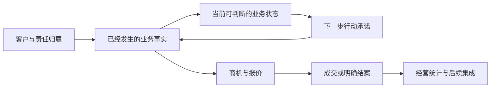
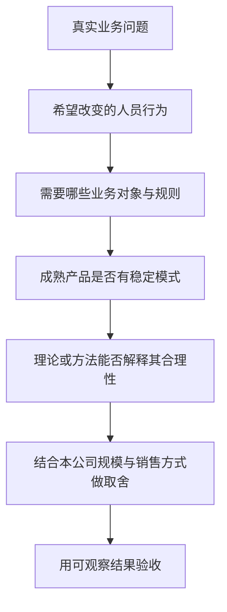
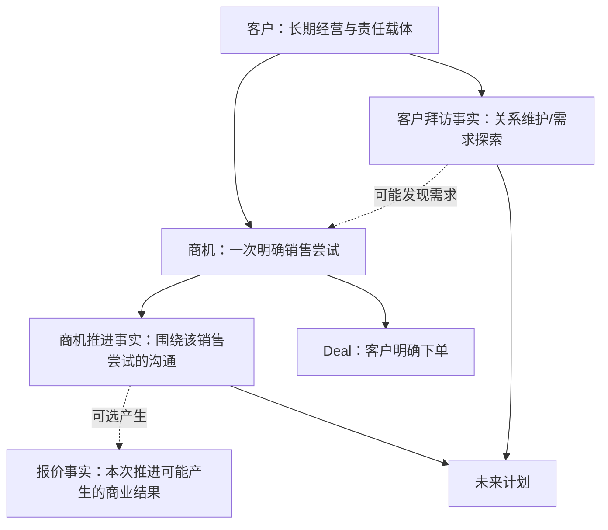

# CRM 业务设计方法与成熟产品借鉴

> 本文是 Lite CRM 的方法型设计参考。它不重复 PRD，也不按品牌罗列功能，而是回答三个问题：成熟 CRM 为什么这样设计；这些做法背后有哪些理论和实践来源；我们应当借鉴什么、舍弃什么。

## 一、先给结论：成熟 CRM 的价值不在“功能多”

成熟 CRM 的共同价值，是把分散在销售个人记忆、聊天记录和后台台账中的业务，组织成一条可以持续推进的经营链：



这条链路有三个彼此不能替代的信息层：

| 信息层   | 回答的问题             | 典型内容                                     | 设计要求                                 |
| -------- | ---------------------- | -------------------------------------------- | ---------------------------------------- |
| 历史事实 | 实际发生了什么         | 拜访、商机推进、报价、成交、归属变化         | 追加留痕，发生后原则上只读               |
| 当前状态 | 现在处于什么情况       | 当前负责人、开放商机阶段、有效报价、客户等级 | 从事实或明确命令形成，可解释、可重算     |
| 未来计划 | 接下来由谁在何时做什么 | 下次拜访、下次商机推进、客诉跟进             | 可改期、可执行、能追溯来源，不能冒充事实 |

如果三个层次混在一张“销售活动表”中，短期看字段少，后续一定会出现：计划完成后历史消失、直接补录误完成待办、报价金额重复累加、客户状态无法解释、管理看板与真实过程不一致。Lite CRM 此前多轮模型修订的核心，本质上就是把这三层重新分开并建立闭环。

因此，本项目的设计主张可以压缩为一句话：

> **CRM 不是要求销售多填一套表，而是让同一业务事实只填一次，随后自动服务于个人待办、客户上下文、商机推进、管理判断和经营统计。**

## 二、如何判断“先进经验”是否值得采用

一个功能出现在知名 CRM 中，不等于它适合本公司。借鉴时应按以下证据层次判断：

| 层次           | 代表                                                | 能说明什么                               | 不能直接说明什么                   |
| -------------- | --------------------------------------------------- | ---------------------------------------- | ---------------------------------- |
| 战略与学术框架 | 战略 CRM、客户组合、关键客户管理研究                | CRM 应解决的管理问题、组织和信息边界     | 具体页面和字段怎样做               |
| 研究型销售方法 | SPIN                                                | 复杂 B2B 沟通中应理解哪些客户问题        | 所有问题都必须成为必填字段         |
| 实践型销售方法 | MEDDIC、活动导向销售                                | 如何检查商机质量、如何关注可控行动       | 对本公司所有销售都适用同一套复杂度 |
| 跨产品共同模式 | Salesforce、Dynamics、HubSpot、Pipedrive 的共同做法 | 经过广泛产品实践验证的通用交互和对象边界 | 任何一家产品的术语都是真理         |
| 本公司业务规则 | 园区陌拜、客户维护、组合报价、下单确认              | 最终系统必须遵守的真实约束               | 可以忽略外部经验而任意建模         |

采用某项设计时，应形成完整的判断链：



外部产品和理论的作用是校验设计，不是代替业务判断。最终优先级依次是：真实业务约束、数据语义正确、使用者获得价值、成熟模式佐证、界面形式相似。

## 三、代表产品处于什么位置，值得借鉴什么

### 3.1 Salesforce：企业级 CRM 平台与对象模型范本

Salesforce 的优势不只是功能多，而是将客户、联系人、商机、活动、任务和相关对象放在相对稳定的对象体系中，再为不同角色提供工作区。其官方资料将商机页设计成一个行动优先的工作区：顶部突出关键状态和阶段指导，中间可快速记录活动，Activity Timeline 将“下一步”和“过去活动”分组呈现；客户页则更偏向快速查阅上下文。[Salesforce Trailhead：Lightning Experience](https://trailhead.salesforce.com/content/learn/modules/lex_salesforce_basics/lex_salesforce_basics_getting_started)

对本项目有价值的部分：

- 客户详情首先服务于判断和行动，而不是从上到下展示数据库字段。
- 商机阶段、历史活动和未来动作同时可见，但语义分区。
- 时间线来自真实活动，不预先画出并未发生的固定步骤。
- 快捷操作应复用业务能力和表单组件，不要求用户跳转到另一个对象页面才能填报。

不应照抄的部分：Salesforce 面向大型组织和高度可配置场景，其通用活动对象、记录类型、自动化和权限配置能力很强。Lite CRM 当前无需复制平台级元数据系统，也不能因为 Salesforce 有 Task/Event，就把本公司的拜访、商机推进和普通任务混成一个通用业务事实。

### 3.2 Microsoft Dynamics 365 Sales：销售工作列表与组织协同

Dynamics 365 Sales Accelerator 将到期和逾期活动组织成 Work List，并在同一工作区提供客户背景、过去和未来活动、关联记录及“下一最佳动作”；活动既可由管理者配置的 sequence 产生，也可由销售临时增加。[Microsoft Learn：Prioritize sales pipeline with work lists](https://learn.microsoft.com/en-us/dynamics365/sales/prioritize-sales-pipeline-through-work-list)

对本项目有价值的部分：

- 工作台应围绕“今天该处理谁”组织，不应只是客户表或商机表的移动版。
- 待办必须带着客户、商机及历史上下文，否则只是另一张任务清单。
- 系统计划和临时业务活动可以并存，但应能区分来源。
- 管理视图建立在同一行动事实之上，不再要求销售另填周报台账。

我们的差异化取舍：Dynamics 的工作列表会在任务完成后将其从列表移除；Lite CRM 的周视图还承担个人复盘，因此完成计划在原计划日期置灰保留，并把实际业务事实单独沉淀。两者目标不同，并非谁更先进。

### 3.3 HubSpot：营销—销售生命周期与低门槛数据治理

HubSpot 的 Lifecycle stage 用于表示联系人或公司在营销和销售流程中的位置，默认从订阅者、线索、营销合格线索、销售合格线索、商机一直到客户；阶段可以由关联关系、导入、工作流和人工操作更新，并保留进入、退出及停留时间等计算属性。[HubSpot：Use contact and company lifecycle stages](https://knowledge.hubspot.com/records/use-lifecycle-stages)

HubSpot 还允许通过导入、列表批量编辑和工作流批量更新生命周期阶段；默认自动化主要向前推进，向后设置需要明确清空后再赋值。[HubSpot：Update lifecycle stages in bulk](https://knowledge.hubspot.com/records/change-record-lifecycle-stages-in-bulk?is_listing=false)

对本项目有价值的部分：

- 生命周期状态不只是展示标签，还应有明确的更新来源和历史。
- 冷启动导入允许带入已知业务事实，不必伪造客户在 CRM 中不存在的完整历史过程。
- 状态可用于筛选、自动化和统计，但必须能解释为何进入该状态。

不能直接照抄之处：HubSpot 的 Lifecycle stage 主要描述营销到销售的交接过程；本项目的“潜在客户/新客户/老客户”描述商业关系事实，客户等级描述资源投入策略，`active/public/invalid` 描述归属治理状态。三者不是一个维度，不能合并成一套“客户状态”。我们可以借鉴 HubSpot 的可追溯和可导入原则，但不照搬其词汇和阶段序列。

### 3.4 Pipedrive：活动导向销售与“始终有下一步”

Pipedrive 是更聚焦销售执行的 CRM。其产品明确以行动为界面主轴：销售完成已安排活动时，系统继续提示增加下一活动；管理者可查看计划、逾期和未安排活动的商机。[Pipedrive：Activities and goals](https://www.pipedrive.com/en/features/activities-goals)

其 Rotting 功能会按阶段配置的闲置天数标记长期未更新商机，体现了“商机池必须暴露停滞”的产品思想。[Pipedrive：The Rotting feature](https://support.pipedrive.com/en/article/the-rotting-feature)

对本项目最直接的启发是：结果金额不可被销售直接控制，但下一次有价值的客户行动可以被计划和检查。因此开放商机不应只保存阶段和预计成交日，还要持续回答“下一步由谁在何时做什么”。

但 Pipedrive 的 Rotting 主要按“记录最后更新时间”计时，编辑字段、邮件等动作都可能重置计时，且未来已安排活动不阻止其变为 rotting。Lite CRM 不照抄这一启发式，而是从明确业务事实派生多个风险：无下一行动、行动逾期、长时间无真实推进、预计成交日已过。界面只突出首要风险，但底层保留多个可解释信号。

### 3.5 SAP、Oracle、Zoho 与 Freshsales：看发展阶段，不抢跑

- SAP Sales Cloud、Oracle Sales 的价值更多体现在大型企业治理、复杂流程和 ERP/供应链协同。它们证明“销售—订单—交付—回款”的全链条可以形成，但这依赖成熟主数据、接口和后台系统基础。本项目与 Open5000 打通在方向上成立，当前仍应先把 CRM 内的销售事实做可信。
- Zoho CRM、Freshsales 更能说明中小企业 CRM 需要较低录入成本、移动端快速操作、自动化和较轻的配置能力。对约 20 人的外勤销售团队，这类“够用且不打断现场工作”的思路，比一开始复制大型企业套件更有价值。

具体产品能力和官网来源可继续查阅已有调研：[《B2B CRM 全球代表产品与移动端体验调研》](./B2B-CRM全球代表产品与移动端体验调研.md)。

## 四、背后的理论和方法从哪里来

下列理论与产品模式之间主要是“能够相互解释”的关系。除非厂商明确说明，本文不声称某款软件直接依据某一理论设计；这样可以避免为常见产品模式事后强行寻找理论出处。

### 4.1 战略 CRM：CRM 首先是跨职能经营体系

Payne 与 Frow 2005 年发表于 _Journal of Marketing_ 的框架，将 CRM 放在战略和跨职能过程层面，归纳为五类过程：战略发展、价值创造、多渠道整合、信息管理、绩效评估。[Payne & Frow：A Strategic Framework for Customer Relationship Management](https://doi.org/10.1509/jmkg.2005.69.4.167)

这是本文所列方法中抽象层级最高、学术性最强的一类。它能解释：

- CRM 不能只是销售日志或联系人通讯录。
- 客户分级不是加一个标签，而是为了差异化资源投入与价值创造。
- 微信、展会、园区拜访、后台订单数据最终需要在同一客户关系视角下整合。
- 经营看板必须建立在信息管理完成后，不能先画图再补事实。

它不能直接回答“拜访表有哪些字段”或“移动端卡片怎样排版”。这类具体设计仍需由业务过程和产品实践决定。

### 4.2 客户组合与关键客户管理：为何要做客户分级

工业 B2B 很早就出现了以客户为核心的组合分析。Fiocca 1982 年提出面向工业企业的 Account Portfolio Analysis，考虑派生需求和买卖双方关系，用于指导差异化客户策略。[Fiocca：Account portfolio analysis for strategy development](<https://doi.org/10.1016/0019-8501(82)90034-7>)

Homburg、Workman 与 Jensen 2002 年的关键客户管理研究进一步把 KAM 看成活动、参与角色、资源和正式化方式的组织配置问题，并发现不同配置存在绩效差异。[Homburg et al.：A Configurational Perspective on Key Account Management](https://doi.org/10.1509/jmkg.66.2.38.18471)

这说明 S/A/B/C 分级的目的应是决定资源和管理策略，而不是制造一个静态荣誉标签。系统至少需要支持：等级名额、等级变更历史、按等级观察拜访覆盖与商机贡献，以及将来结合产品结构和客户价值调整规则。但现阶段不应冒充精确的客户终身价值模型，也不应仅凭历史成交金额自动决定全部等级。

### 4.3 SPIN：指导一次高质量 B2B 沟通

SPIN 是 Huthwaite 基于大量销售沟通观察形成的方法，使用 Situation、Problem、Implication、Need-payoff 四类问题理解客户背景、问题、影响和解决后的价值，并强调在沟通结束时获得可推动销售的下一步承诺。[Huthwaite：The SPIN Methodology](https://www.huthwaiteinternational.com/spin-methodology)

它处于“销售沟通方法”层，不是 CRM 数据模型。对本项目的合理用法是：

- 未来可以为拜访或商机推进提供可选的沟通提示和复盘模板。
- 推进结论应尽量说明客户问题、影响、需求和承诺，而不是只写“已联系”。
- 下一行动应来自双方确认的推进需要，而非系统为了闭环强行生成一句空话。

不宜在当前阶段把 SPIN 四问直接做成四个必填字段，否则会增加销售负担，并造成大量形式化内容。

### 4.4 MEDDIC / MEDDPICC：检查复杂商机是否真的可靠

MEDDIC 起源于 1990 年代 PTC 的复杂企业销售实践，关注 Metrics、Economic Buyer、Decision Criteria、Decision Process、Identify Pain、Champion，后续版本加入 Competition 和 Paper Process。[MEDDICC：MEDDPICC sales methodology and origin](https://meddicc.com/meddpicc-sales-methodology-and-process)

它属于实践型商机资格审查方法，特别适合多决策人、采购和合同过程复杂的大额销售。它对未来的价值是为重点商机提供“缺口检查”：是否知道经济决策人、选型标准、审批过程、竞争对手及量化价值。

本公司当前销售周期和商机复杂度并不完全一致，因此不应把完整 MEDDPICC 变成所有商机的固定必填项。更合适的演进方式是：先用真实数据识别大额、跨部门或长期商机，再给这类商机启用轻量资格检查或管理辅导。

### 4.5 活动导向销售：关注可控的领先指标

“活动导向销售”更多是实践与产品哲学，而不是严格的学术理论。它区分：成交金额等结果指标是滞后的，拜访、推进、确认下一步等活动是销售可以直接控制的领先指标。Pipedrive 把这一思想直接做进了产品界面。

Lite CRM 借鉴的不是“多统计电话次数”，而是两点：

1. 每个开放商机需要有可执行的下一步，否则管理者无法判断它是否仍在推进。
2. 活动数量不能等同于质量；必须同时保留结果、对象、计划和后续承诺，避免为了指标制造无效动作。

### 4.6 PDCA 与闭环控制：为什么计划和实际必须形成回路

PDCA 是 Plan–Do–Check–Act 的持续改进循环，ASQ 将其描述为反复执行的四步过程，用于设计、验证和改善重复性工作流程。[ASQ：PDCA Cycle](https://asq.org/quality-resources/pdca-cycle)

本项目的“计划 → 执行 → 记录实际 → 安排下一步”借用了闭环思想，但不能把二者说成完全相同：销售跟进不是质量实验，下一行动也不是 PDCA 中的 Act。真正可借鉴的是：

- 计划和实际必须能对应，才能复盘偏差。
- 执行结果不能抹去原计划。
- 复盘后的调整应形成下一轮行动，而不是让链路自然中断。

因此完成计划在周视图中置灰保留、实际事实独立只读、下一计划重新进入未来日期，是有业务依据的闭环，而不只是界面偏好。

## 五、这些经验如何落到 Lite CRM 的业务模型

### 5.1 客户、拜访与商机必须分开



- 客户拜访可以只用于维护关系或发现需求，未必存在商机。
- 为推进商机而进行现场拜访，在业务上仍是商机推进事实，沟通方式为“现场”，不需要再复制一条客户拜访事实。
- 商机是独立销售尝试，拥有自己的阶段、金额、跟进、报价和结案原因。
- 报价是商机推进可能产生的结果，不是与“商机跟进”平级的另一条销售流程。

这一模型比“所有内容都是 Activity”更具体，也更符合当前工业设备直销。通用活动模型适合作为跨类型读取投影或平台扩展层，不应反过来抹平领域事实差异。

### 5.2 计划是独立对象，但不是独立业务事实

计划之所以需要建模，是因为它有事实记录不具备的生命周期：待执行、改期、被实际事实完成、因领域终态取消；它还要出现在未来日期、个人工作台和管理视图中。

但计划本身不说明“实际做了什么”。正确关系是：

```text
计划（未来承诺） --sourcePlanId--> 实际拜访/商机推进/客诉跟进（历史事实）
```

关键规则：

- 从某条计划进入填报，才完成该计划。
- 直接补录实际事实，不得凭客户或商机相同自动完成已有计划。
- 开放商机推进、客户拜访和未解决客诉完成后，应产生或沿用唯一下一计划。
- 改期保留计划身份和调整历史，不制造“取消后新建”的虚假断点。
- 只有客户释放/无效、商机结案、客诉解决等真实业务终态可以取消剩余计划。

### 5.3 报价采用版本事实，而不是覆盖金额

实际业务允许口头报价 0..N 次、正式报价 0..N 次。每次报价都是当时真实发生的商业事实，应保留；新报价自动取代上一条有效报价作为“当前报价”，但不删除历史。

这同时解决三个问题：

- 销售和管理者能看到价格变化过程。
- 当前意向池只取一条有效报价或预估金额，不会累计多个版本。
- 成交必须由“客户明确下单”命令产生，不能由出现正式报价或金额变化隐式推断。

### 5.4 时间线是读取视图，不是另一套业务数据

客户活动时间线和商机进展时间线应由已有事实投影得到：拜访、商机发现、每次推进、每次报价、成交/结案、客诉及归属变化。它们的作用是把分散对象组织成用户容易理解的叙事，不应再维护一张“时间线记录表”。

未来计划单独展示，不伪装成已经发生的时间线节点。已发生内容点击后只读；需要继续工作时，从所属客户或商机进入新的业务操作。

### 5.5 客户状态必须拆成正交维度

| 维度         | 业务含义                       | 例子                         | 更新方式                                 |
| ------------ | ------------------------------ | ---------------------------- | ---------------------------------------- |
| 归属治理状态 | 当前能否由销售经营、是否在公海 | active、public、invalid      | 认领、释放、移交、判无效等明确命令       |
| 商业关系阶段 | 是否已有成交关系               | 潜在客户、本年新客、存量客户 | 由成交事实和冷启动历史事实派生           |
| 客户等级     | 公司决定投入多少资源           | S、A、B、C                   | 受名额和权限约束的经营决策，保留变更历史 |

冷启动导入的老客户不需要伪造商机、报价和订单时间线；使用一个明确的“CRM 外已有成交事实”即可确定关系阶段，可选保存轻量历史成交金额用于参考。以后 CRM 内真实 Deal 形成后，正常按事实派生。

### 5.6 管理风险和看板必须来自可解释事实

成熟产品普遍提供 pipeline、停滞提醒和管理工作列表，但本项目不应为了看板再建一套状态。管理层真正需要的是：

- 当前开放商机有多少、金额依据是什么；
- 哪些商机无下一行动、已逾期、长时间无推进或预计成交日已过；
- 当前报价池里哪些仍可信；
- 各区域和销售的客户覆盖、推进和结果如何；
- 客户等级与产品结构是否朝经营目标改善。

这些指标应从客户、商机、报价、计划和 Deal 事实计算。当前存量与期间流量分开；同一商机的历次报价不重复求和；列表可显示一个首要风险以降低视觉噪音，底层仍保留全部风险信号。

### 5.7 权限是“能力 × 数据范围”

角色只回答“能做什么”，组织范围回答“能看哪些数据”。销售管理人员可以同时填报和查看递归下属；管理层也不等于天然查看全公司，而应按所配置组织范围取数。界面入口按能力隐藏或禁用，后端每次查询和命令仍必须执行数据范围校验。

这一分法比“每个角色写一套页面权限”更可靠，也支持未来大区调整而不重写功能。

### 5.8 移动端不是桌面端缩小版

移动端的核心场景是现场和当天：先看到今日/逾期计划，再点击具体计划完成填报；临时发生的拜访、商机推进或客诉也允许直接记录。选中日展示详细内容，七天摘要帮助比较和回顾，周概览不维护第二份数据。

移动端每次操作应减少重复输入，但不能减少业务语义：计划来源、实际结果、下一日期和内容仍需完整；扫码、语音、定位、拍照等能力应在真实需要出现后逐步加入，而不是先做技术展示。

## 六、哪些“看似高级”的做法当前不宜采用

| 做法                           | 当前不采用的原因                              | 何时重新评估                         |
| ------------------------------ | --------------------------------------------- | ------------------------------------ |
| 完整 MEDDPICC 强制字段         | 对全部商机过重，销售会形式化填写              | 大额、长周期、多决策人商机数量足够时 |
| 自动生成销售 sequence          | 当前先确保下一计划真实可信                    | 已积累可复用的分行业/阶段行动模板时  |
| AI 自动评分与下一最佳动作      | 数据量和标签尚不足，容易制造伪精确            | 历史事实完整且人工规则可验证后       |
| 统一“客户活动”大表承载所有事实 | 拜访、商机推进、报价、客诉字段和终态不同      | 只在跨领域搜索/时间线投影层统一      |
| 全链条 CRM—ERP 双向联动        | Open5000 可以打通，但接口和主数据治理需要时间 | CRM 销售事实稳定、订单口径确认后     |
| 复杂客户终身价值模型           | 历史数据不完整，当前规模下收益有限            | 订单、毛利、回款与客户主数据稳定后   |
| 大屏式 BI                      | 容易先做展示后补事实，不能直接指导处置        | 经营问题、指标口径和下钻动作稳定后   |

“暂不采用”并非否定价值，而是把能力放在它成立的前提之后。

## 七、以后评审 CRM 新功能的十二个问题

任何新功能进入 PRD 前，应至少回答：

1. 它要解决哪个真实业务问题，改变谁的什么行为？
2. 它表示历史事实、当前状态、未来计划，还是读取投影？
3. 它的业务责任主体是谁，归属于客户、商机、客诉还是订单？
4. 是否已有事实源，新增字段会不会形成第二套台账？
5. 谁能创建、修改、查看，数据范围如何计算？
6. 生命周期如何开始、推进和终止；终态后还有哪些动作允许发生？
7. 是否需要下一行动，如何防止计划断链或重复？
8. 桌面端和移动端分别处于什么使用情境，是否需要不同信息层级？
9. 数据是业务日期还是系统审计时间，是否需要两者同时保留？
10. 管理者将如何使用这条数据作判断或下钻处置？
11. 外部成熟产品是否存在相近模式，其解决的问题是否真的相同？
12. 理论、产品惯例和本公司规则之间，哪些是证据，哪些只是待验证假设？

如果一个需求无法回答第 1、2、4、6 项，通常还不应进入编码；如果无法回答第 8 项，不应直接复制桌面页面到移动端；如果无法回答第 10 项，也不应以“管理需要”为由增加销售填报字段。

## 八、面向后续建设的系统化借鉴方式

后续不需要每次从零开始讨论。建议将功能打磨固定为四步：

1. **回到业务现场**：用实际案例说明客户、商机、报价或计划如何发生，避免只讨论字段名称。
2. **确认模型层次**：先区分事实、状态、计划和投影，再讨论页面。
3. **选择外部参照**：从本文产品定位中选择真正同类的模式；客户生命周期可看 HubSpot，商机工作区和时间线可看 Salesforce，行动工作台可看 Dynamics，下一行动和停滞管理可看 Pipedrive。
4. **形成可验收规则**：写入 PRD、架构蓝图或交互基线，并用真实链路验证，而不是以“页面已经有这个按钮”作为完成标准。

这套方法也给出了不同材料的职责：

- 本文解释为什么这样设计，以及外部依据是什么；
- `PRD.md` 规定用户、规则和验收结果；
- `重构架构决策与实施蓝图.md` 规定对象、状态、事务和数据边界；
- `交互设计打磨.md` 规定用户如何看见和完成这些业务；
- Git、测试和实施记录证明代码是否已经做到。

## 九、最终判断

Lite CRM 当前方向与成熟 CRM 的基本规律是一致的：以客户为责任载体、以商机表达销售尝试、以真实活动形成上下文、以下一行动维持推进、以明确成交事实连接后续经营结果。

它不需要成为 Salesforce 的缩小版，也不应只做一个更好看的 Excel。更合理的目标是：在工业设备线下直销这个具体场景中，先把客户经营、拜访、商机、报价、计划和成交的语义做得足够准确、操作足够自然、数据足够可信；在此基础上再逐步增加客户组合优化、Open5000 集成、经营看板和智能辅助。

真正值得借鉴的“先进经验”不是某个按钮放在哪里，而是成熟产品和方法共同揭示的原则：**对象边界清楚、事实能够追溯、状态可以解释、行动不会断链、录入能够反哺使用者、管理结论能够下钻到事实。**
