# Lite CRM 技术规格（New Project Spec）

> 用途：面向执行与 AI coding 开发的技术规格，全部为结论性内容。

---

## 目录

1. 项目定位
2. 技术栈
3. 仓库结构
4. 核心决策（12 项）
5. 前端规格
6. 后端规格
7. 数据模型
8. 功能规格
9. 集成与部署
10. 开发与工程
11. 里程碑 M0–M9

---

## 一、项目定位

**面向小团队、线下拜访型 B2B 销售的轻量 CRM**：销售外勤用移动端填报客户动态/拜访/商机/客诉；管理者在桌面端查看经营看板（销售漏斗/转化/储备等）；形成「记录 → 跟进 → 闭环 → 洞察」链路。

| 优先级 | 领域                                                          |
| ------ | ------------------------------------------------------------- |
| P0     | 移动端填报体验（拜访/商机/客诉「顺手、快、不打断」）          |
| P1     | 数据闭环质量（事件与状态并存、事实日期准确、权限正确）        |
| P2     | 管理看板全面化（销售漏斗/转化/储备——AI insight 的确定性底座） |

**规模（已确认）**：客户 ~2000；用户 15；填报 ~150 条/天 → 单台普通服务器足够，**正确性与可维护性优先于性能**。

**环境（已确认）**：

- 桌面浏览器：Chrome + Edge
- 移动浏览器：Android 常规浏览器为主 + 少量 iOS Safari；钉钉内 WebView
- 部署：腾讯云 Linux 云服务器（单台 2C4G）；域名 + IP 已有（**ICP 备案待办**）
- 账号：初期账号密码；后期钉钉免登
- 双端访问：同域名不同路径 `/`（桌面）+ `/mobile/`（移动），入口按 UA 自动跳转，钉钉微应用 URL 配 `/mobile/`

---

## 二、技术栈

| 类别              | 选型                                                                       | 版本/说明                                                            |
| ----------------- | -------------------------------------------------------------------------- | -------------------------------------------------------------------- |
| 包管理 / Monorepo | pnpm + pnpm workspace + turborepo                                          | 任务编排只重建变更部分                                               |
| 前端框架          | Vue 3 + TypeScript + Vite + vue-tsc                                        |                                                                      |
| 桌面 UI           | Element Plus                                                               | 管理后台                                                             |
| 移动 UI           | Vant 4                                                                     | 移动 H5 填报端                                                       |
| 前端状态/路由     | Pinia + Vue Router                                                         |                                                                      |
| 后端框架          | NestJS 11                                                                  |                                                                      |
| 数据层            | Drizzle ORM + drizzle-kit                                                  | 迁移驱动                                                             |
| 数据库            | PostgreSQL 16+                                                             | 扩展：pg_trgm（查重检索）；pgvector M8 预留                          |
| 后端配套          | class-validator + Swagger + @nestjs/jwt + bcryptjs + @nestjs/event-emitter | 密码散列用 bcryptjs（纯 JS 实现 bcrypt 算法，避免 Windows 原生编译） |
| 契约生成          | openapi-typescript（类型）+ 手写薄 client                                  | CI 校验无 diff                                                       |
| 测试              | Vitest（前后端统一，含 NestJS；不用 Jest）+ @vue/test-utils + supertest    |                                                                      |
| 代码规范          | ESLint + Prettier + husky + lint-staged + commitlint                       |                                                                      |

---

## 三、仓库结构

> 架构模式：分层架构——表现层（apps/web、apps/mobile）/ 应用层（api 的 service）/ 领域层（packages/domain）/ 基础设施层（Drizzle、PG）。依赖方向：表现→应用→领域，基础设施依赖领域层（依赖倒置），禁止跨层调用。

```
crm/
  apps/
    web/                      # 桌面端：管理后台全集（Element Plus）
      src/pages/  src/features/  src/router/  src/theme/
    mobile/                   # 移动端 H5：填报子集（Vant）
      src/pages/  src/features/  src/router/  src/theme/
    api/                      # NestJS + Drizzle
      src/
        access/ auth/ org/ audit/ catalog/ customers/ claims/
        activities/ opportunities/ complaints/ planning/ expenses/
        team/ reporting/ ai/ alerts/ common/
  packages/
    contracts/                # openapi-typescript 生成契约（只含生成物 + 少量补充类型）
    domain/                   # 两端共享业务层
      services/               #   API 薄 client（基于生成契约）
      stores/                 #   Pinia（session/角标/周上下文）
      composables/            #   useQuery、格式化、权限判断
      types/                  #   非 API 领域类型
    design-tokens/            # 双端统一主题变量
    eslint-config/  tsconfig/
  docs/                       # adr/、milestones/
  pnpm-workspace.yaml
```

**硬性约束**：

- 后端是唯一事实源：DTO → Swagger → 契约 → 前端，单向下发
- domain 层唯一：API 调用、状态、权限判断、校验规则只在 packages/domain，两端 import，禁止复制
- 页面禁止直接 fetch / 拼 URL，一律走 domain/services
- 枚举单源：一律 import 契约枚举，禁止手写字符串字面量
- UI 库只管外观层，业务逻辑零重复

---

## 四、核心决策（12 项）

| #   | 决策         | 结论                                                                                                               |
| --- | ------------ | ------------------------------------------------------------------------------------------------------------------ |
| 1   | 产品边界     | 独立设计 CRM，不与 OGSM/OKR 合并                                                                                   |
| 2   | 双端形态     | 桌面 Web 管理后台 + 移动 H5（浏览器/后期钉钉内嵌），不做原生                                                       |
| 3   | 前端技术栈   | Vue 3 + TS；桌面 Element Plus、移动 Vant；monorepo 双入口共享 domain                                               |
| 4   | 数据获取     | Pinia + 手写 useQuery（接口对齐 TanStack Query 预留升级口）                                                        |
| 5   | 前后端契约   | openapi-typescript 生成类型 + 手写薄 client + CI 校验无 diff；前端禁手写枚举字面量，非 API 类型留 domain 层        |
| 6   | 数据层       | Drizzle，synchronize 退役，迁移驱动                                                                                |
| 7   | 旧库数据     | 原型数据首版不迁，验证通过后 ETL 补迁；对账=客户/商机/Deal/客诉/费用，派生字段由事件重算，过程态不迁               |
| 8   | 里程碑       | M0–M9（见第十一章）                                                                                                |
| 9   | 权限模型     | 混合访问控制：RBAC 管操作（能力点）× 组织树管数据范围，服务端唯一裁决；角色 4 类（见 6.2）                         |
| 10  | AI 能力预留  | ai/ 模块两域（intake 录入 + insight 分析），叠加通道不碰事实层；M0-M7 只留 schema 与模块位，M8 insight → M9 intake |
| 11  | 客户查重检索 | 分层漏斗：唯一索引硬拦截 + pg_trgm 模糊提示（≥0.5）+ pgvector AI 变体预留；不引独立搜索引擎（见 7.3）              |
| 12  | 跨模块联动   | 强一致=直接调用+同事务；弱一致=@nestjs/event-emitter 进程内事件；不引消息队列（见 6.4）                            |

---

## 五、前端规格

### 5.1 双端应用与功能分配

| 功能域                         | 桌面端      | 移动端               |
| ------------------------------ | ----------- | -------------------- |
| 销售日志（拜访/商机/客诉填报） | 表格 + 表单 | 移动表单（主场景）   |
| 客户档案                       | 完整编辑    | 查看 + 关键字段编辑  |
| 客户搜索/列表                  | 复杂筛选    | 精简搜索             |
| 风险看板                       | 桌面看板    | 移动卡片             |
| 周计划/管理意见                | 完整        | 查看 + 简单反馈      |
| 费用                           | 完整        | 快速记一笔           |
| 团队执行/团队费用              | 只读聚合    | 只读聚合             |
| 管理看板（漏斗/储备/转化，P2） | 完整        | 个人指标首页（后置） |
| 人员/业务周/客户分类配置       | ✅          | ❌                   |
| 接管审批                       | 完整        | 审批动作（后置）     |
| Excel 导出                     | ✅          | ❌                   |

**功能域清单**：身份组织 / 客户档案与归属治理 / 销售日志 / 商机闭环 / 客诉闭环 / 周计划与指导意见 / 费用 / 团队执行 / 管理看板 / 接管审批 / 风险看板 / 提醒与审计。

### 5.2 前端分层

> 模式：前端分层架构——页面编排层（pages，只做组装）/ 领域组件层（features）/ 基础设施层（libs）。

```
pages/          # 路由页面，只做编排（单组件 ≤ 400 行）
features/       # 领域组件 + 领域 composable（每业务域一个目录）
libs/           # api（传输层）/ query（useQuery）/ auth（Pinia store）/ ui（共享组件）
```

### 5.3 数据获取（useQuery）

> 模式：Repository 模式——页面不直接访问数据源，经 domain/services（repository 抽象）获取；useQuery 是缓存/加载封装。

```ts
// packages/domain/src/composables/useQuery.ts
// 接口对齐 TanStack Query：useQuery({ key, fetcher, options })；约 40 行
// 暴露 data / loading / error / reload() / setData()

const { data, loading, reload } = useQuery(`customers:list:${filters}`, () =>
  listCustomers(filters),
)
// 写操作后：reload() 或 setData()，不整页刷新
```

- 跨页共享状态（session/权限快照/角标/业务周）走 Pinia stores

### 5.4 重合功能 schema 共享（防双端表单漂移）

- domain 层定义字段配置（字段名/类型/必填/选项/校验/提交字段），桌面与移动表单组件读取同一份配置渲染
- 改字段只改 domain 一份，双端同时生效
- 主链路 e2e 双端各跑一遍，重合功能行为一致

---

## 六、后端规格

### 6.1 权限模型

> 参考：PDP/PEP——Guard 为策略执行点（PEP），统一权限服务为策略决策点（PDP），决策集中一处。

权限是贯穿所有业务模块的横切基础设施，由三个正交组件构成：

```
┌────────────────┐   ┌────────────────┐   ┌────────────────┐
│ 身份 Identity   │   │ 组织 Organization│   │ 授权 Authorization│
│ 我是谁？        │   │ 我属于哪个树？   │   │ 我能做什么/看什么？ │
│ (登录/JWT)     │   │ (reportsToId)  │   │ (能力点×数据范围)  │
└───────┬────────┘   └───────┬────────┘   └───────┬────────┘
        └────────────────────┼────────────────────┘
                             ▼
                   业务模块（查询/写操作必经横切）
```

- **三组件解耦**：登录不关心你有几个下属；组织树不管你会不会「导出」；授权只问「这个操作+这批数据，对你放行吗」
- **授权是唯一决策点**：「能做什么」由 Guard 统一裁决（能力点）；「能看什么」由统一权限服务在查询层过滤（数据范围）
- **服务端唯一决策**：前端只消费登录返回的权限快照（capabilities + dataScope），绕过前端的 API 调用同样被拦
- **审计独立**：「谁做了什么」是另一条横切链，与授权正交但依赖身份

**访问控制模式：混合式（RBAC × 组织树）**

| 模式                                     | 判断                             |
| ---------------------------------------- | -------------------------------- |
| 纯 RBAC（角色→权限）                     | 表达不了「看下属的」树形数据范围 |
| 纯 ABAC（属性→策略）                     | 策略引擎对小团队是负资产         |
| **混合：RBAC 管操作 + 组织树管数据范围** | **选定**——管理后台最常见形态     |

**数据范围（组织树自动推导）**：self（本人）/ team（本人+直属下属递归）/ full（全量）；admin/assistant 短路为 full；所有列表/搜索/看板查询统一 `WHERE owner_id IN (可见集合)`；region 是数据属性，不进权限模型

### 6.2 角色模型（4 类 = 能力组合）

| 角色             | 数据范围（树自动）    | 基础填报 | 管理操作    | 经营看板 | 全量统计/导出 | 系统配置 |
| ---------------- | --------------------- | -------- | ----------- | -------- | ------------- | -------- |
| sales 销售       | self / team           | ✅       | 有下属时 ✅ | ❌       | ❌            | ❌       |
| executive 经营层 | team（总经理=全公司） | ✅       | ✅          | ✅       | ❌            | ❌       |
| assistant 业助   | full                  | ❌       | ❌          | ✅ 只读  | ✅            | ❌       |
| admin 管理员     | full                  | 可选     | ✅          | ✅       | ✅            | ✅       |

- 用户 = 1 个角色 + reportsToId（上级）；管理层级完全由树决定，不设独立角色
- 销售线角色（sales/executive）默认具备填报；**经营看板仅 executive（方案 A）**
- assistant = 全量只读 + 统计确认的数据质量负责人（AI 统计的确认人，能力位预留）

### 6.3 后端模块清单

> 模式：模块化分层——每域 module/controller/service；业务模块依赖基础设施（access/auth/audit/common），禁止反向；业务模块间经服务接口或事件协作。

```
src/
  access/        # 组织范围权限（横切基础设施，收敛可见性计算）
  auth/          # 登录（password + dingtalk provider 抽象）/JWT/改密
  org/           # 用户、角色、汇报树、区域
  audit/         # 审计日志
  catalog/       # 客户维度配置（产业/应用/类型/产品线/来源）
  customers/     # 客户档案、联系人、验重、归属、移交、公海
  claims/        # 接管认领审批流
  activities/    # 拜访 + 销售日志聚合（查询面）
  opportunities/ # 商机 + 商机事件 + 成交 Deal
  complaints/    # 客诉 + 跟进事件
  planning/      # 业务周 + 周计划 + 指导意见
  expenses/      # 费用 + 作废
  team/          # 团队执行/费用/风险看板（只读聚合）
  reporting/     # 管理看板（经营三件套首批：漏斗/储备预测/转化率归因；趋势/结构后置，只读聚合）
  ai/            # AI 能力（intake 录入侧 + insight 分析侧；M8+ 实现，预留模块位）
  alerts/        # 提醒（定时扫描 + 站内）
  common/        # 基础 schema/枚举/过滤器
```

约束：业务服务禁止自行遍历组织树算权限，一律走统一权限服务；每接口必配 class-validator DTO。

### 6.4 跨模块联动

> 模式：本地事件（In-process Events）+ Unit of Work——强一致联动同一 UoW 提交；弱一致发布订阅。

- **强一致（直接调用 + 同一事务）**：拜访→自动生成周计划项、接管批准→三域交接（商机/客诉/未来计划项）
- **弱一致（@nestjs/event-emitter 进程内事件）**：商机推进→提醒、客诉登记→风险告警；失败不阻塞主流程
- 不引消息队列/事件总线

### 6.5 安全基线

| 项        | 方案                                                   |
| --------- | ------------------------------------------------------ |
| 登录凭证  | access token 2h + refresh token 14d 无感刷新           |
| 防爆破    | 同一账号连续 5 次密码错误锁定 15 分钟（按账号）        |
| 敏感字段  | 手机号等列表脱敏（138****1234），详情页/有权限者见全号 |
| 改密/停用 | 已签发 token 立即失效（token 版本号校验）              |

---

## 七、数据模型

### 7.1 schema 原则

> 领域建模模式：事件溯源变体（Event Log + 状态快照）——事件表只追加、主表存当前状态；聚合根封装不变量；命令/查询分离。

- 基础 schema：id（UUID 文本型）+ createdAt + updatedAt + version（乐观锁）
- 关系查询按需声明（with），默认高效 join，防 N+1
- 枚举/状态统一 **varchar + CHECK 约束 + 应用层枚举**（不用 PG enum——避免 ALTER TYPE 迁移坑）；users 表预留 phone（钉钉绑定）
- **AI 预留**：业务记录带 `entry_source`（manual/voice/image/chat/ai）+ `entry_ref_id`（原始素材引用）；预留 `ai_drafts` 草稿确认通道（AI 永不直接写业务数据，先草稿→人工确认→落库）；结构化优先，自由文本受控；指标口径单一来源；pg_trgm 现在上，pgvector M8 时装扩展 + 独立向量表（customer_embeddings，业务表不存向量）

### 7.2 实体清单（域 → 表）

> 聚合根：Customer / Opportunity / Complaint / WeeklyPlan / DailyExpense；其余为聚合内实体或事件。

| 域            | 实体表                                                               |
| ------------- | -------------------------------------------------------------------- |
| org           | users、capacity_config、user_capacity_overrides                      |
| customers     | customers、contacts、customer_transfers                              |
| opportunities | opportunities、opportunity_events、deals                             |
| complaints    | complaints、complaint_follow_ups                                     |
| activities    | visit_records                                                        |
| planning      | business_weeks、weekly_plans、weekly_plan_items、management_comments |
| expenses      | daily_expenses                                                       |
| claims        | customer_claim_requests                                              |
| catalog       | customer_dimension_options                                           |
| alerts        | alerts                                                               |
| audit         | audit_logs                                                           |

### 数据模型 ER 图（Mermaid）

> 颜色约定：🟢 实体表（主数据/业务对象）｜🟠 关系表（明细/事件/流水）。

> 设计约定：① 字典字段（industry/sub_industry/customer_type/source/product_lines）存**字符串快照**，字典改名不同步、历史自洽；② 多态引用（management_comments/alerts/audit_logs）为**弱引用**，写路径必须校验目标存在；③ 派生字段（first_visited_at 等）由事件写入。
> 设计约定（功能边界）：① 费用=轻量统计（draft/submitted/voided 服务统计口径），无审批流，报销单据查验/审批打款排除在 CRM 边界外；② 下次拜访=visit 留档 + 强一致生成周计划项提醒（无溯源关联）；③ 计划与拜访两表独立，团队执行看板分列展示，不做配对。
> 设计约定（必填标注）：字段级 `?` = 数据库层可空；记录级条件必填（如「至少一个联系人电话」）用备注/应用层约束表达，不反映在字段级。
> 设计约定（归属语义）：归属单一事实源在 customers.owner_id（当前归属）；子实体（商机/客诉/拜访/跟进）的 owner_id = **创建时归属快照**（不可变，历史回溯用），当前归属一律 JOIN 客户推导——归属变更只改客户，子实体自动跟随且历史保留。
> 设计约定（选项字典化）：**业务描述性分类进字典（customer_dimension_options，admin 可配置）**——客户维度 5 类 + complaint_type/trade_type/opportunity_source/visit_type；**状态机与权限不进字典**（stage/status/role/ability 保持代码枚举，避免配置与运行逻辑脱节）。字典 name 存 key，显示文案由前端 domain 映射；录入时应用层校验字典存在（DB 不设 CHECK，支持扩展）。

#### 01 组织与客户域

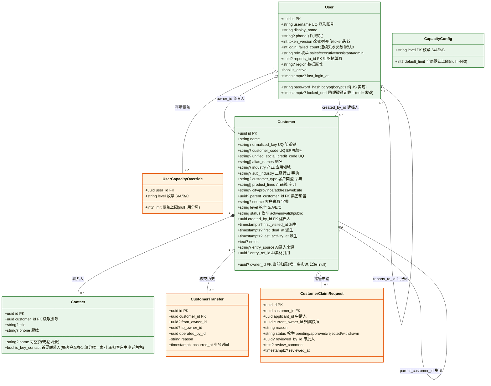
```mermaid
classDiagram
    class User {
        +uuid id PK
        +string username UQ 登录账号
        +string display_name
        +string? phone 钉钉绑定
        +string password_hash bcrypt(bcryptjs 纯 JS 实现)
        +int token_version 改密/停用使token失效
        +int login_failed_count 连续失败次数 默认0
        +timestamptz? locked_until 防爆破锁定截止(null=未锁)
        +string role 枚举 sales/executive/assistant/admin
        +uuid? reports_to_id FK 组织树单源
        +string? region 数据属性
        +bool is_active
        +timestamptz? last_login_at
    }
    class CapacityConfig {
        +string level PK 枚举 S/A/B/C
        +int? default_limit 全局默认上限(null=不限)
    }
    class UserCapacityOverride {
        +uuid user_id FK
        +string level 枚举 S/A/B/C
        +int? limit 覆盖上限(null=用全局)
    }
    User "1" o-- "0..*" UserCapacityOverride : 容量覆盖
    style CapacityConfig fill:#e8f5e9,stroke:#2e7d32
    style UserCapacityOverride fill:#fff3e0,stroke:#e65100
    class Customer {
        +uuid id PK
        +string name
        +string normalized_key UQ 防重键
        +string? customer_code UQ ERP编码
        +string? unified_social_credit_code UQ
        +string[] alias_names 别名
        +string? industry 产业/应用领域
        +string? sub_industry 二级行业 字典
        +string? customer_type 客户类型 字典
        +string[] product_lines 产品线 字典
        +string? city/province/address/website
        +uuid? parent_customer_id FK 集团预留
        +string? source 客户来源 字典
        +string level 枚举 S/A/B/C
        +string status 枚举 active/invalid/public
        +uuid? owner_id FK 当前归属(唯一事实源,公海=null)
        +uuid created_by_id FK 建档人
        +timestamptz? first_visited_at 派生
        +timestamptz? first_deal_at 派生
        +timestamptz? last_activity_at 派生
        +text? notes
        +string? entry_source AI录入来源
        +uuid? entry_ref_id AI素材引用
    }
    class Contact {
        +uuid id PK
        +uuid customer_id FK 级联删除
        +string? name 可空(裸电话场景)
        +string? title
        +string? phone 脱敏
        +bool is_key_contact 首要联系人(每客户至多1·部分唯一索引·承担客户主电话角色)
    }
    class CustomerTransfer {
        +uuid id PK
        +uuid customer_id FK
        +uuid? from_owner_id
        +uuid? to_owner_id
        +uuid operated_by_id
        +string reason
        +timestamptz occurred_at 业务时间
    }
    class CustomerClaimRequest {
        +uuid id PK
        +uuid customer_id FK
        +uuid applicant_id 申请人
        +uuid current_owner_id 归属快照
        +string reason
        +string status 枚举 pending/approved/rejected/withdrawn
        +uuid? reviewed_by_id 审批人
        +text? review_comment
        +timestamptz? reviewed_at
    }
    User "0..*" --> "0..1" User : reports_to_id 汇报树
    User "1" o-- "0..*" Customer : owner_id 负责人
    User "1" -- "0..*" Customer : created_by_id 建档人
    Customer "1" *-- "0..*" Contact : 联系人
    Customer "1" o-- "0..*" CustomerTransfer : 移交历史
    Customer "1" o-- "0..*" CustomerClaimRequest : 接管申请
    Customer "1" o-- "0..1" Customer : parent_customer_id 集团
    style User fill:#e8f5e9,stroke:#2e7d32
    style Customer fill:#e8f5e9,stroke:#2e7d32
    style Contact fill:#e8f5e9,stroke:#2e7d32
    style CustomerTransfer fill:#fff3e0,stroke:#e65100
    style CustomerClaimRequest fill:#fff3e0,stroke:#e65100
```

#### 02 商机与成交域

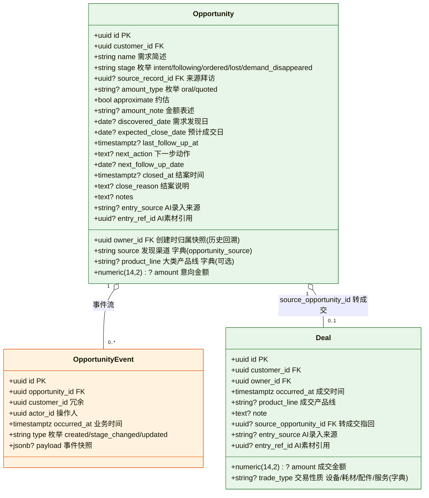
```mermaid
classDiagram
    class Opportunity {
        +uuid id PK
        +uuid customer_id FK
        +uuid owner_id FK 创建时归属快照(历史回溯)
        +string name 需求简述
        +string stage 枚举 intent/following/ordered/lost/demand_disappeared
        +string source 发现渠道 字典(opportunity_source)
        +string? product_line 大类产品线 字典(可选)
        +uuid? source_record_id FK 来源拜访
        +string? amount_type 枚举 oral/quoted
        +numeric(14,2)? amount 意向金额
        +bool approximate 约估
        +string? amount_note 金额表述
        +date? discovered_date 需求发现日
        +date? expected_close_date 预计成交日
        +timestamptz? last_follow_up_at
        +text? next_action 下一步动作
        +date? next_follow_up_date
        +timestamptz? closed_at 结案时间
        +text? close_reason 结案说明
        +text? notes
        +string? entry_source AI录入来源
        +uuid? entry_ref_id AI素材引用
    }
    class OpportunityEvent {
        +uuid id PK
        +uuid opportunity_id FK
        +uuid customer_id 冗余
        +uuid actor_id 操作人
        +timestamptz occurred_at 业务时间
        +string type 枚举 created/stage_changed/updated
        +jsonb? payload 事件快照
    }
    class Deal {
        +uuid id PK
        +uuid customer_id FK
        +uuid owner_id FK
        +timestamptz occurred_at 成交时间
        +numeric(14,2)? amount 成交金额
        +string? product_line 成交产品线
        +string? trade_type 交易性质 设备/耗材/配件/服务(字典)
        +text? note
        +uuid? source_opportunity_id FK 转成交指回
        +string? entry_source AI录入来源
        +uuid? entry_ref_id AI素材引用
    }
    Opportunity "1" o-- "0..*" OpportunityEvent : 事件流
    Opportunity "1" o-- "0..1" Deal : source_opportunity_id 转成交
    style Opportunity fill:#e8f5e9,stroke:#2e7d32
    style Deal fill:#e8f5e9,stroke:#2e7d32
    style OpportunityEvent fill:#fff3e0,stroke:#e65100
```

#### 03 业务活动域

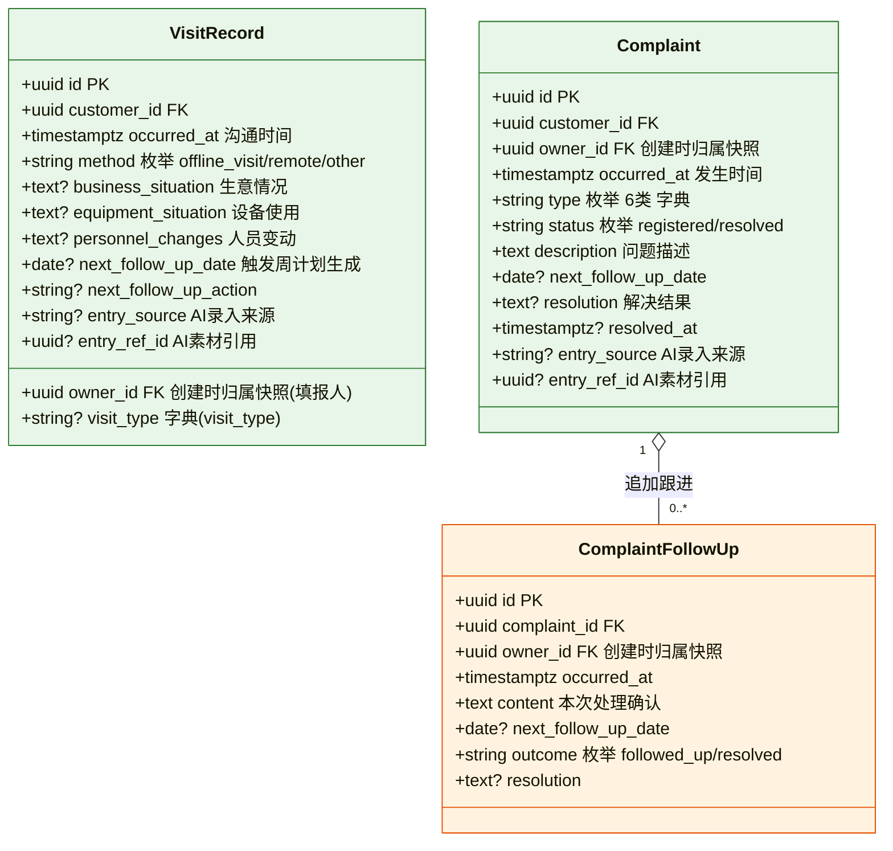
```mermaid
classDiagram
    class VisitRecord {
        +uuid id PK
        +uuid customer_id FK
        +uuid owner_id FK 创建时归属快照(填报人)
        +timestamptz occurred_at 沟通时间
        +string method 枚举 offline_visit/remote/other
        +string? visit_type 字典(visit_type)
        +text? business_situation 生意情况
        +text? equipment_situation 设备使用
        +text? personnel_changes 人员变动
        +date? next_follow_up_date 触发周计划生成
        +string? next_follow_up_action
        +string? entry_source AI录入来源
        +uuid? entry_ref_id AI素材引用
    }
    class Complaint {
        +uuid id PK
        +uuid customer_id FK
        +uuid owner_id FK 创建时归属快照
        +timestamptz occurred_at 发生时间
        +string type 枚举 6类 字典
        +string status 枚举 registered/resolved
        +text description 问题描述
        +date? next_follow_up_date
        +text? resolution 解决结果
        +timestamptz? resolved_at
        +string? entry_source AI录入来源
        +uuid? entry_ref_id AI素材引用
    }
    class ComplaintFollowUp {
        +uuid id PK
        +uuid complaint_id FK
        +uuid owner_id FK 创建时归属快照
        +timestamptz occurred_at
        +text content 本次处理确认
        +date? next_follow_up_date
        +string outcome 枚举 followed_up/resolved
        +text? resolution
    }
    Complaint "1" o-- "0..*" ComplaintFollowUp : 追加跟进
    style VisitRecord fill:#e8f5e9,stroke:#2e7d32
    style Complaint fill:#e8f5e9,stroke:#2e7d32
    style ComplaintFollowUp fill:#fff3e0,stroke:#e65100
```

#### 04 计划/费用/支撑域

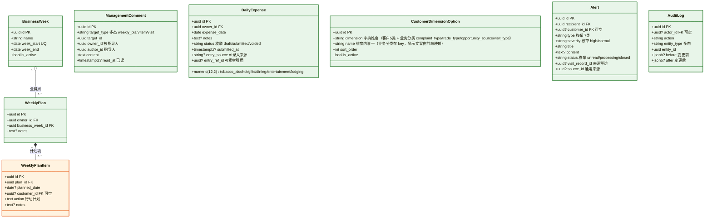
```mermaid
classDiagram
    class BusinessWeek {
        +uuid id PK
        +string name
        +date week_start UQ
        +date week_end
        +bool is_active
    }
    class WeeklyPlan {
        +uuid id PK
        +uuid owner_id FK
        +uuid business_week_id FK
        +text? notes
    }
    class WeeklyPlanItem {
        +uuid id PK
        +uuid plan_id FK
        +date? planned_date
        +uuid? customer_id FK 可空
        +text action 行动计划
        +text? notes
    }
    class ManagementComment {
        +uuid id PK
        +string target_type 多态 weekly_plan/item/visit
        +uuid target_id
        +uuid owner_id 被指导人
        +uuid author_id 指导人
        +text content
        +timestamptz? read_at 已读
    }
    class DailyExpense {
        +uuid id PK
        +uuid owner_id FK
        +date expense_date
        +numeric(12,2) tobacco_alcohol/gifts/dining/entertainment/lodging
        +text? notes
        +string status 枚举 draft/submitted/voided
        +timestamptz? submitted_at
        +string? entry_source AI录入来源
        +uuid? entry_ref_id AI素材引用
    }
    class CustomerDimensionOption {
        +uuid id PK
        +string dimension 字典维度（客户5类 + 业务分类 complaint_type/trade_type/opportunity_source/visit_type）
        +string name 维度内唯一（业务分类存 key，显示文案由前端映射）
        +int sort_order
        +bool is_active
    }
    class Alert {
        +uuid id PK
        +uuid recipient_id FK
        +uuid? customer_id FK 可空
        +string type 枚举 7类
        +string severity 枚举 high/normal
        +string title
        +text? content
        +string status 枚举 unread/processing/closed
        +uuid? visit_record_id 来源拜访
        +uuid? source_id 通用来源
    }
    class AuditLog {
        +uuid id PK
        +uuid? actor_id FK 可空
        +string action
        +string entity_type 多态
        +uuid entity_id
        +jsonb? before 变更前
        +jsonb? after 变更后
    }
    BusinessWeek "1" o-- "0..*" WeeklyPlan : 业务周
    WeeklyPlan "1" *-- "0..*" WeeklyPlanItem : 计划项
    style BusinessWeek fill:#e8f5e9,stroke:#2e7d32
    style WeeklyPlan fill:#e8f5e9,stroke:#2e7d32
    style WeeklyPlanItem fill:#fff3e0,stroke:#e65100
    style ManagementComment fill:#e8f5e9,stroke:#2e7d32
    style DailyExpense fill:#e8f5e9,stroke:#2e7d32
    style CustomerDimensionOption fill:#e8f5e9,stroke:#2e7d32
    style Alert fill:#e8f5e9,stroke:#2e7d32
    style AuditLog fill:#e8f5e9,stroke:#2e7d32
```

### 7.3 检索与查重

> 检索模式：三阶段检索（Exact 精确 → Fuzzy 模糊 → Vector 向量），各层职责边界清晰。

| 层     | 方案                                               | 时机 |
| ------ | -------------------------------------------------- | ---- |
| 精确层 | normalizedKey/客户编码/信用代码 唯一索引（硬拦截） | M2   |
| 模糊层 | pg_trgm 相似度查重 + GIN 索引加速检索              | M2   |
| AI 层  | pgvector embedding 变体识别                        | M8+  |

- **查重判定**：归一化后完全相等/信用代码或编码相同 → 硬拦截；别名/简称精确命中 或 trigram 相似度 ≥ 0.5 → 提示疑似重复（不拦截，忽略动作留审计）
- **归一化**：去空格/统一大小写/去「有限公司/集团」等后缀（效果比调阈值大）
- **检索排序**：完全匹配 > 前缀匹配 > 包含匹配 > 别名命中 > trigram 相似度兜底；输入即搜（防抖 300ms）
- **权限边界**：查重/搜索可命中权限外客户，但只返回最小标识（名称+城市）；详情必须走权限校验
- **迁移**：drizzle-kit 生成 SQL 迁移提交进仓库；CI 校验生成物无 diff

---

## 八、功能规格

> 功能级推敲（时序图 + 关键规则 + 数据读写），是实现的直接依据；数据模型见第七章。

### 8.1 登录与身份

#### 时序流程（账号密码通道）

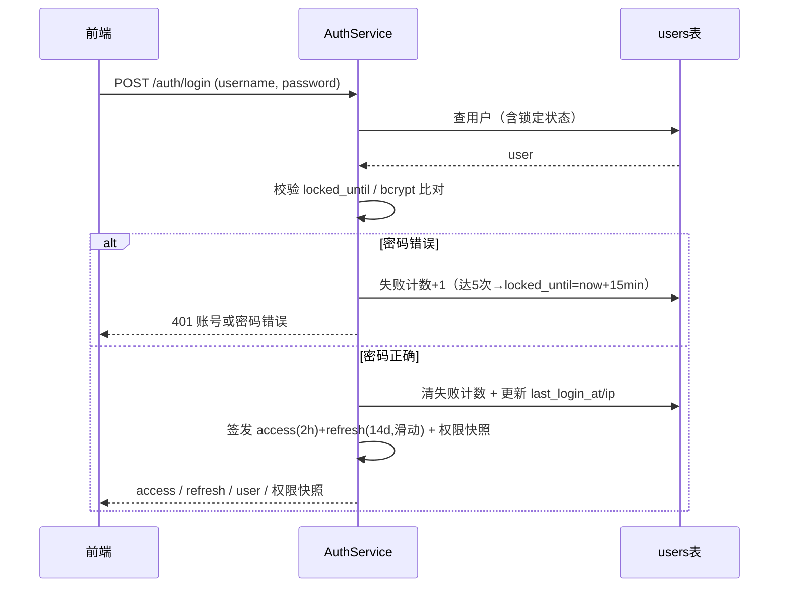
```mermaid
sequenceDiagram
    participant C as 前端
    participant S as AuthService
    participant U as users表
    C->>S: POST /auth/login (username, password)
    S->>U: 查用户（含锁定状态）
    U-->>S: user
    S->>S: 校验 locked_until / bcrypt 比对
    alt 密码错误
        S->>U: 失败计数+1（达5次→locked_until=now+15min）
        S-->>C: 401 账号或密码错误
    else 密码正确
        S->>U: 清失败计数 + 更新 last_login_at/ip
        S->>S: 签发 access(2h)+refresh(14d,滑动) + 权限快照
        S-->>C: access / refresh / user / 权限快照
    end
```

#### 关键规则

| 规则       | 内容                                                                                      |
| ---------- | ----------------------------------------------------------------------------------------- |
| 防爆破     | 连续 5 次密码错误 → locked_until = now+15min；锁定期内拒绝（按账号）                      |
| 凭证       | access 2h + refresh 14d（JWT 无状态，**滑动续期**）                                       |
| token 失效 | JWT 携带 token_version；改密/停用 users.token_version+1 → 全部旧 token 失效（含 refresh） |
| 权限快照   | 登录响应带 capabilities + dataScope（dataScope 由组织树当次推导）                         |
| 登出       | 前端清理本地 token；服务端无撤销（改密/停用靠 token_version 兜底）                        |

#### 钉钉免登（M6）

- auth provider 抽象：password / dingtalk 两通道（/auth/login + /auth/dingtalk）
- 钉钉：dd.getAuthCode → 后端换身份（手机号匹配 users.phone）→ 复用同一签发逻辑
- 共用：签发、token_version、权限快照逻辑

#### 数据读写

| 操作     | 表       | 说明                                                             |
| -------- | -------- | ---------------------------------------------------------------- |
| 登录校验 | users 读 | username/password_hash/role/is_active/token_version/locked_until |
| 登录成功 | users 写 | last_login_at/ip、清失败计数                                     |
| 登录失败 | users 写 | 失败计数、锁定时间                                               |
| 改密     | users 写 | password_hash + token_version+1                                  |

#### 改密码（本人）

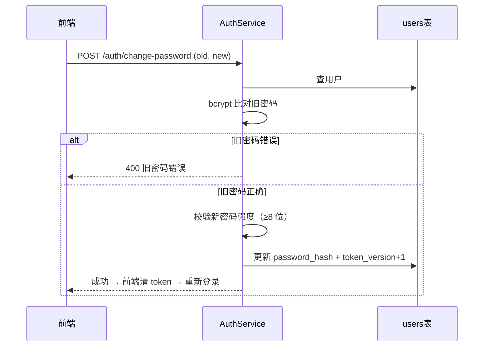
```mermaid
sequenceDiagram
    participant C as 前端
    participant S as AuthService
    participant U as users表
    C->>S: POST /auth/change-password (old, new)
    S->>U: 查用户
    S->>S: bcrypt 比对旧密码
    alt 旧密码错误
        S-->>C: 400 旧密码错误
    else 旧密码正确
        S->>S: 校验新密码强度（≥8 位）
        S->>U: 更新 password_hash + token_version+1
        S-->>C: 成功 → 前端清 token → 重新登录
    end
```

规则：旧密码 bcrypt 校验；新密码 ≥8 位；改密后 token_version+1 → 全部 token（含 refresh）立即失效，所有设备重新登录。

#### 重置密码（管理员）

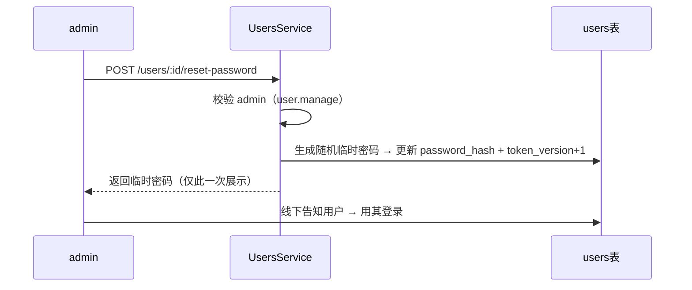
```mermaid
sequenceDiagram
    participant A as admin
    participant S as UsersService
    participant U as users表
    A->>S: POST /users/:id/reset-password
    S->>S: 校验 admin（user.manage）
    S->>U: 生成随机临时密码 → 更新 password_hash + token_version+1
    S-->>A: 返回临时密码（仅此一次展示）
    A->>U: 线下告知用户 → 用其登录
```

规则：仅 admin（user.manage）；生成随机临时密码（不手填）；重置 token_version+1 → 该用户全端失效；不做自助找回、不做强制改密（保持简单）。

#### 多端登录

- 允许一账号多端（手机+电脑）同时在线——外勤常态；不做单端互斥
- 安全性由 token_version 兜底（改密/重置 → 全端失效）
- 数据模型无新增字段；未来若需强制改密加 must_change_password（当前不做）

> 推敲补充：users 加 login_failed_count + locked_until（防爆破状态持久化，已入 ER 图）。

### 8.2 客户录入与查重

#### 必填策略

| 字段          | 策略                     | 说明                                                            |
| ------------- | ------------------------ | --------------------------------------------------------------- |
| name          | 必填                     | 可地址式名称（园区客户填「XX工业园3栋2楼」）                    |
| 联系人电话    | 必填（至少一个，可无名） | 电话统一挂联系人（main_phone 已废弃）；无名联系人承担「裸电话」 |
| address       | 软建议                   | 园区客户自然要填                                                |
| 信用代码/编码 | 可选                     | 有则权威硬查重                                                  |

#### 查重管道（五步）

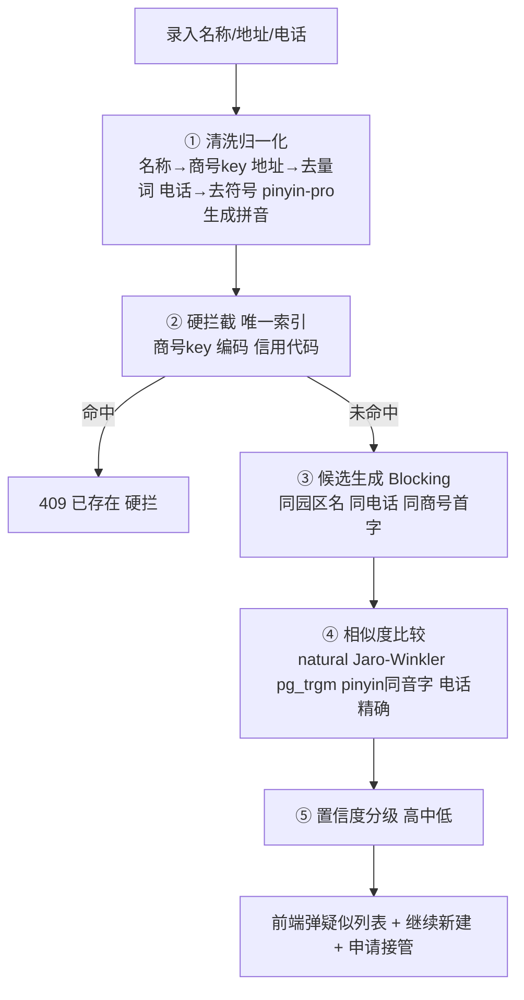
```mermaid
flowchart TD
    A[录入名称/地址/电话] --> B[① 清洗归一化<br/>名称→商号key 地址→去量词 电话→去符号 pinyin-pro生成拼音]
    B --> C[② 硬拦截 唯一索引<br/>商号key 编码 信用代码]
    C -->|命中| D[409 已存在 硬拦]
    C -->|未命中| E[③ 候选生成 Blocking<br/>同园区名 同电话 同商号首字]
    E --> F[④ 相似度比较<br/>natural Jaro-Winkler pg_trgm pinyin同音字 电话精确]
    F --> G[⑤ 置信度分级 高中低]
    G --> H[前端弹疑似列表 + 继续新建 + 申请接管]
```

#### 主次通道与库组合

| 通道         | 字段                  | 保证       | 实现                                                 |
| ------------ | --------------------- | ---------- | ---------------------------------------------------- |
| 名称（主）   | name                  | 必填       | natural(Jaro-Winkler) + pg_trgm + pinyin-pro(同音字) |
| 电话（主）   | contacts.phone        | 至少一必填 | 归一化后精确                                         |
| 地址（增强） | address               | 软建议     | pg_trgm                                              |
| 权威（硬拦） | 商号key/编码/信用代码 | 可选       | 唯一索引                                             |

#### 缺失处理

- 通道「有则参与，无则跳过」——字段缺失不拖累其他通道
- 唯一约束对 NULL 天然放行（没填信用代码的互不误拦）
- 置信度只按参与通道计算
- 口语名 + 无地址无电话 → 软提示「信息不完整，可能无法识别重复」（不拦截）

#### 置信度分级

| 置信度 | 命中条件                                                     | 前端                |
| ------ | ------------------------------------------------------------ | ------------------- |
| 高     | 商号key精确 / 地址归一化精确 / 拼音相同且字数相同 / 电话精确 | 醒目提示 + 申请接管 |
| 中     | trigram ≥0.5 / Jaro-Winkler ≥0.8                             | 普通提示            |
| 低     | 弱相似                                                       | 弱提示              |

#### 检索

- 输入即搜（防抖 300ms）：完全 > 前缀 > 包含 > 别名 > trigram 兜底
- 权限过滤：owner_id IN (可见集合)（与查重的全库不同）
- 结果：名称 + 城市 + 负责人 + 等级

#### 批量查重（M7 后）

- 全库跑同管道 → 聚类（传递闭包）→ 疑似重复报告 → 业助处理

#### 权限边界

- 查重/搜索可命中权限外客户，但只返回最小标识（名称+城市）；点击详情走权限
- 命中权限外客户 → 前端显示「已有归属 · 申请接管」

### 8.3 客户归属治理（Ownership Governance）

#### 新建归属（Ownership on Create）

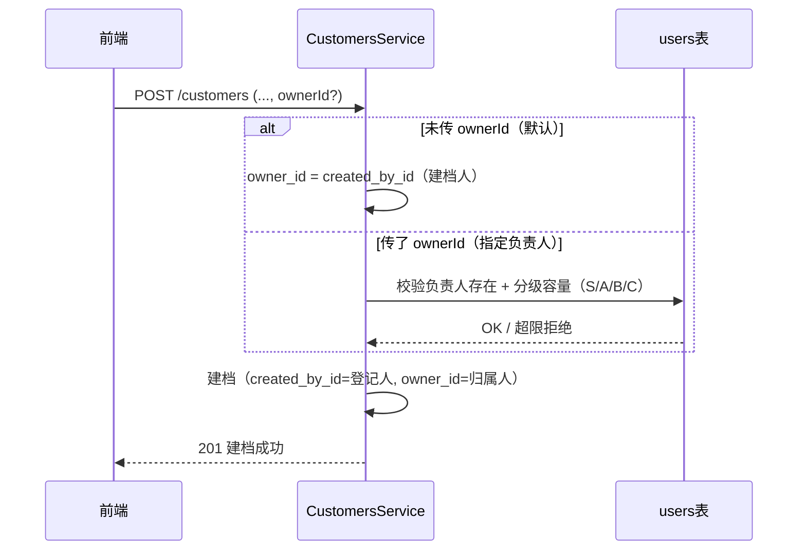
```mermaid
sequenceDiagram
    participant F as 前端
    participant S as CustomersService
    participant U as users表
    F->>S: POST /customers (..., ownerId?)
    alt 未传 ownerId（默认）
        S->>S: owner_id = created_by_id（建档人）
    else 传了 ownerId（指定负责人）
        S->>U: 校验负责人存在 + 分级容量（S/A/B/C）
        U-->>S: OK / 超限拒绝
    end
    S->>S: 建档（created_by_id=登记人, owner_id=归属人）
    S-->>F: 201 建档成功
```

- 数据模型：created_by_id（建档人）与 owner_id（负责人）**两个独立字段**，语义分离
- **默认策略**：未指定负责人 → owner_id = created_by_id（录入即所有权，90% 场景零操作）
- **指定负责人**：录入表单可选传 owner_id（代录场景：业助/管理员帮销售录 → 指定归属该销售），校验容量
- **应用层责任**：默认值、指定、容量校验均在 Service/DTO 层，数据模型无需额外字段

#### 所有权转移（Ownership Transfer）

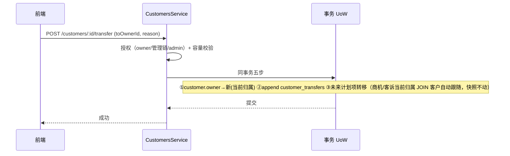
```mermaid
sequenceDiagram
    participant F as 前端
    participant S as CustomersService
    participant T as 事务 UoW
    F->>S: POST /customers/:id/transfer (toOwnerId, reason)
    S->>S: 授权（owner/管理链/admin）+ 容量校验
    S->>T: 同事务五步
    Note over T: ①customer.owner→新(当前归属) ②append customer_transfers ③未来计划项转移（商机/客诉当前归属 JOIN 客户自动跟随，快照不动）
    T-->>S: 提交
    S-->>F: 成功
```

**不变式（Invariant）**：历史事实（已成交/已关闭/已解决记录）所有权快照不可改写。

#### 接管申请（Ownership Claim / Takeover Request）

**状态机**

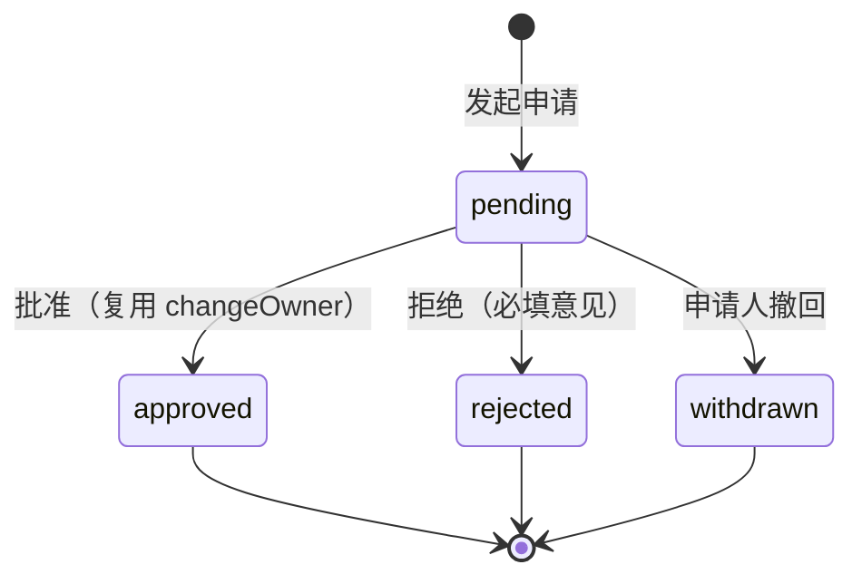
```mermaid
stateDiagram-v2
    [*] --> pending : 发起申请
    pending --> approved : 批准（复用 changeOwner）
    pending --> rejected : 拒绝（必填意见）
    pending --> withdrawn : 申请人撤回
    approved --> [*]
    rejected --> [*]
    withdrawn --> [*]
```

**时序**

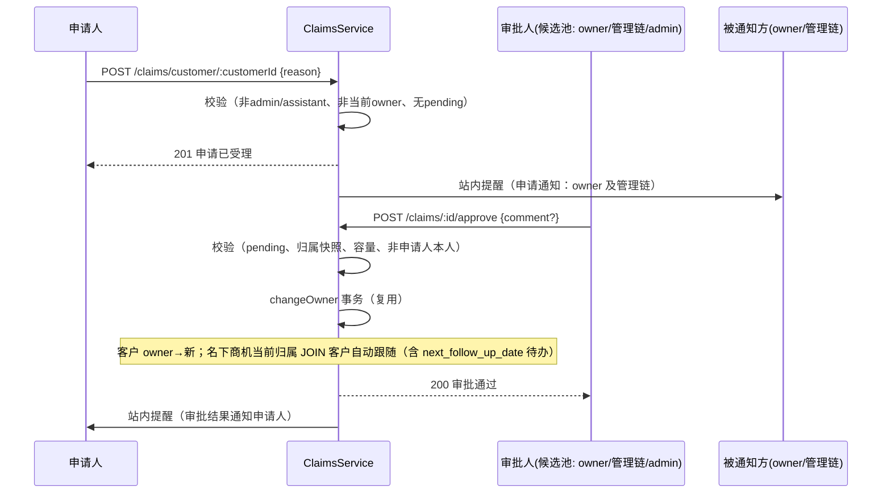
```mermaid
sequenceDiagram
    participant B as 申请人
    participant S as ClaimsService
    participant A as 审批人(候选池: owner/管理链/admin)
    participant N as 被通知方(owner/管理链)
    B->>S: POST /claims/customer/:customerId {reason}
    S->>S: 校验（非admin/assistant、非当前owner、无pending）
    S-->>B: 201 申请已受理
    S->>N: 站内提醒（申请通知：owner 及管理链）
    A->>S: POST /claims/:id/approve {comment?}
    S->>S: 校验（pending、归属快照、容量、非申请人本人）
    S->>S: changeOwner 事务（复用）
    Note over S: 客户 owner→新；名下商机当前归属 JOIN 客户自动跟随（含 next_follow_up_date 待办）
    S-->>A: 200 审批通过
    S->>B: 站内提醒（审批结果通知申请人）
```

**规则（图外补充）**：

- **单点审批（Single-Approver）**：候选池多人、任一批准即生效（非会签）
- **审批候选池**：当前所有权人 + 管理链 + 管理员
- **禁止自我审批**：候选池排除申请人；当前 owner 同意让出自己的客户（被接管方确认）允许
- **并发防护**：同客户仅一条 pending（唯一性）、归属快照校验（currentOwnerId）、容量校验
- **超时升级（轻量）**：pending 超 7 天 → 提醒 owner + 通知管理链

#### 主动释放（Voluntary Release）

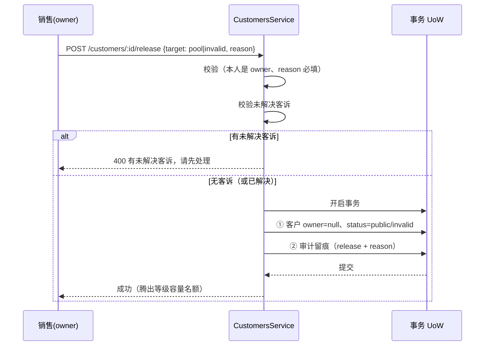
```mermaid
sequenceDiagram
    participant S as 销售(owner)
    participant C as CustomersService
    participant T as 事务 UoW
    S->>C: POST /customers/:id/release {target: pool|invalid, reason}
    C->>C: 校验（本人是 owner、reason 必填）
    C->>C: 校验未解决客诉
    alt 有未解决客诉
        C-->>S: 400 有未解决客诉，请先处理
    else 无客诉（或已解决）
        C->>T: 开启事务
        C->>T: ① 客户 owner=null、status=public/invalid
        C->>T: ② 审计留痕（release + reason）
        T-->>C: 提交
        C-->>S: 成功（腾出等级容量名额）
    end
```

**规则（图外补充）**：

- **权限**：本人是 owner；reason 必填（审计）
- **客诉拦截**：未解决客诉 → 禁止释放（先解决/转交）
- **商机跟随**：商机当前归属 JOIN 客户自动无主（快照保留）——无需同步，无选择项
- **计划项**：作废
- **容量**：owner 所属唯一标准——释放后（owner=null）不占名额
- **去向**：pool（公海，他人可认领）| invalid（无效，记录保留）

#### 公共池（Public Pool）

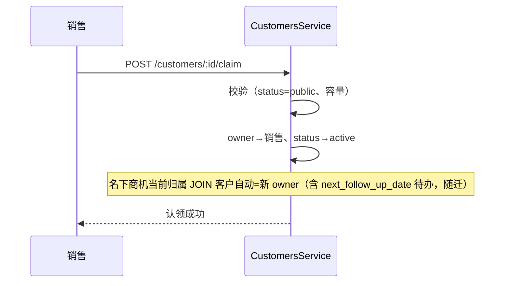
```mermaid
sequenceDiagram
    participant S as 销售
    participant C as CustomersService
    S->>C: POST /customers/:id/claim
    C->>C: 校验（status=public、容量）
    C->>C: owner→销售、status→active
    Note over C: 名下商机当前归属 JOIN 客户自动=新 owner（含 next_follow_up_date 待办，随迁）
    C-->>S: 认领成功
```

- 池回收（Reclamation）：backlog，本期不实现

### 8.4 拜访登记（Visit Logging，P0 主场景）

#### 时序图

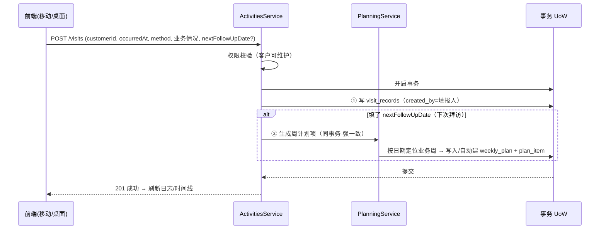
```mermaid
sequenceDiagram
    participant C as 前端(移动/桌面)
    participant V as ActivitiesService
    participant W as PlanningService
    participant D as 事务 UoW
    C->>V: POST /visits (customerId, occurredAt, method, 业务情况, nextFollowUpDate?)
    V->>V: 权限校验（客户可维护）
    V->>D: 开启事务
    V->>D: ① 写 visit_records（created_by=填报人）
    alt 填了 nextFollowUpDate（下次拜访）
        V->>W: ② 生成周计划项（同事务·强一致）
        W->>D: 按日期定位业务周 → 写入/自动建 weekly_plan + plan_item
    end
    D-->>V: 提交
    V-->>C: 201 成功 → 刷新日志/时间线
```

#### 图外规则

| 规则           | 内容                                                                                                   |
| -------------- | ------------------------------------------------------------------------------------------------------ |
| 权限           | 客户可维护（owner/管理链/admin，assertCanContribute）                                                  |
| 必填           | customerId / occurredAt / method；其余可空（**customerId 必填 = 客户旅程原则**，拜访/商机/客诉均必填） |
| 联动（强一致） | 填 nextFollowUpDate → 同事务生成周计划项（决策 12）；计划项 action=「拜访客户 X」                      |
| 业务周定位     | 按日期找业务周；该销售该周无计划 → 自动建 weekly_plan                                                  |
| 数据模型       | visit_records：created_by（填报人）+ 归属 JOIN 客户（快照语义）                                        |
| 登记入口       | 客户详情页「记一笔拜访」/ 销售日志页快速登记 / 周计划项「执行」（实现时定）                            |
| 内联建档       | 客户选择器搜不到 → 表单内联快速建档（name+电话，走查重管道）→ 拜访挂上客户，一个流程不跳出             |
| 例外           | 费用（8.8）不挂客户（支出非客户旅程）；拜访/商机/客诉全必填                                            |

### 8.5 商机闭环（Opportunity Lifecycle）

#### 状态机

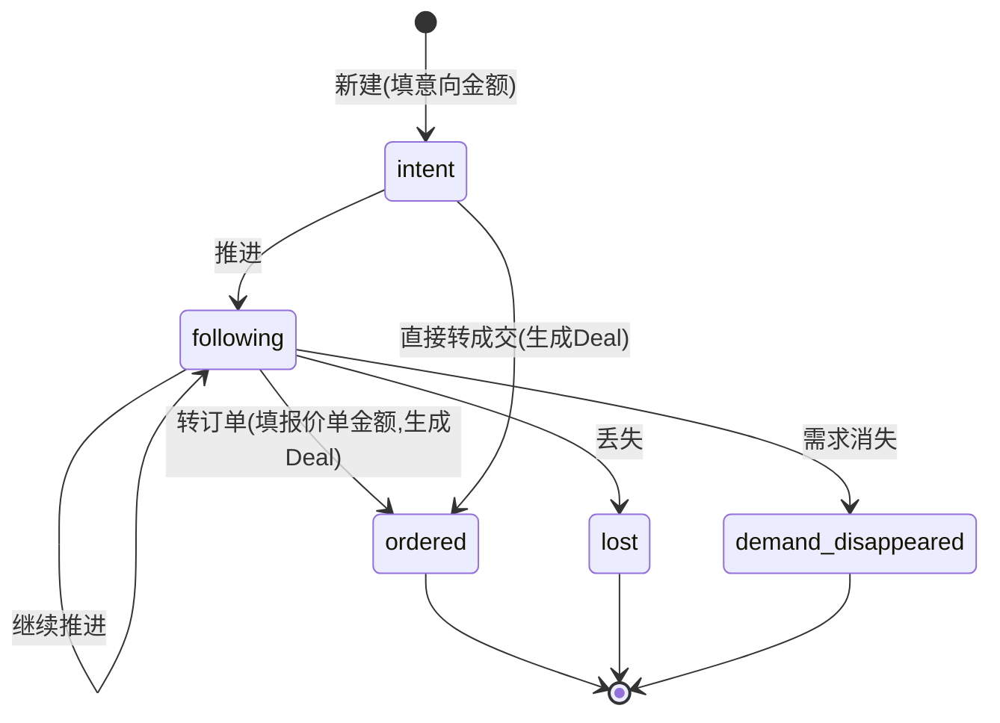
```mermaid
stateDiagram-v2
    [*] --> intent : 新建(填意向金额)
    intent --> following : 推进
    following --> following : 继续推进
    following --> ordered : 转订单(填报价单金额,生成Deal)
    intent --> ordered : 直接转成交(生成Deal)
    following --> lost : 丢失
    following --> demand_disappeared : 需求消失
    ordered --> [*]
    lost --> [*]
    demand_disappeared --> [*]
```

#### 创建 + 推进/转成交

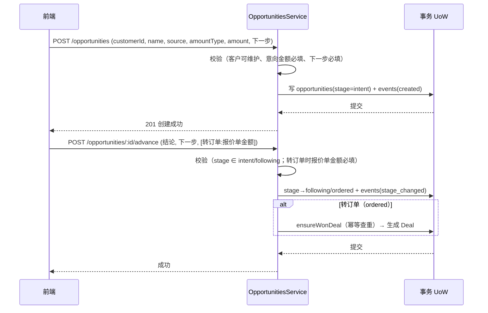
```mermaid
sequenceDiagram
    participant C as 前端
    participant S as OpportunitiesService
    participant D as 事务 UoW
    C->>S: POST /opportunities (customerId, name, source, amountType, amount, 下一步)
    S->>S: 校验（客户可维护、意向金额必填、下一步必填）
    S->>D: 写 opportunities(stage=intent) + events(created)
    D-->>S: 提交
    S-->>C: 201 创建成功
    C->>S: POST /opportunities/:id/advance (结论, 下一步, [转订单:报价单金额])
    S->>S: 校验（stage ∈ intent/following；转订单时报价单金额必填）
    S->>D: stage→following/ordered + events(stage_changed)
    alt 转订单（ordered）
        S->>D: ensureWonDeal（幂等查重）→ 生成 Deal
    end
    D-->>S: 提交
    S-->>C: 成功
```

#### 结案（丢失/需求消失）

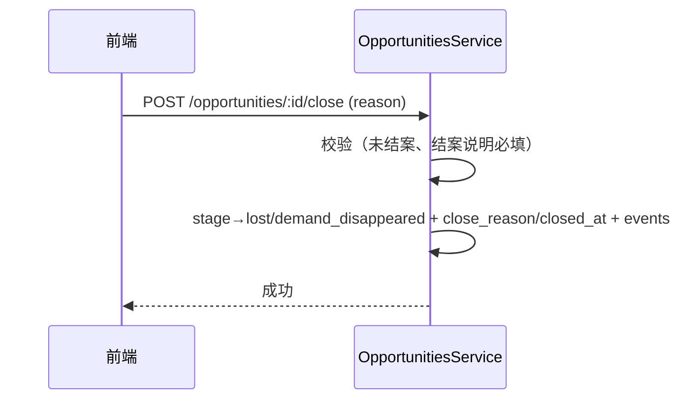
```mermaid
sequenceDiagram
    participant C as 前端
    participant S as OpportunitiesService
    C->>S: POST /opportunities/:id/close (reason)
    S->>S: 校验（未结案、结案说明必填）
    S->>S: stage→lost/demand_disappeared + close_reason/closed_at + events
    S-->>C: 成功
```

#### 图外规则

| 规则                     | 内容                                                                                                   |
| ------------------------ | ------------------------------------------------------------------------------------------------------ |
| 权限                     | 客户可维护（owner/管理链/admin）                                                                       |
| 创建                     | 意向金额（类型+金额）必填；下一步动作/日期必填                                                         |
| 推进                     | 跟进填结论+下次跟进日期；转订单填报价单金额（幂等生成 Deal）                                           |
| 结案                     | 结案说明必填（lost/demand_disappeared）                                                                |
| 事件流                   | 每次变更写 opportunity_events（业务时间，只追加）                                                      |
| **逾期处理（8.3 依赖）** | next_follow_up_date 过期 → 待办标记 → 用 advance（更新日期）或 close 处置                              |
| 数据模型                 | opportunities（stage/source/金额分层/next_follow_up_date）+ opportunity_events + deals（快照语义已定） |

#### 与 8.3 衔接

认领/接管 → 名下商机随迁（含 next_follow_up_date 待办）→ 逾期商机用本节的 advance/close 处置——即「处理逾期」的落点。

### 8.6 客诉闭环（Complaint Lifecycle）

#### 状态机（两态：核心管理终态，进度靠事件）

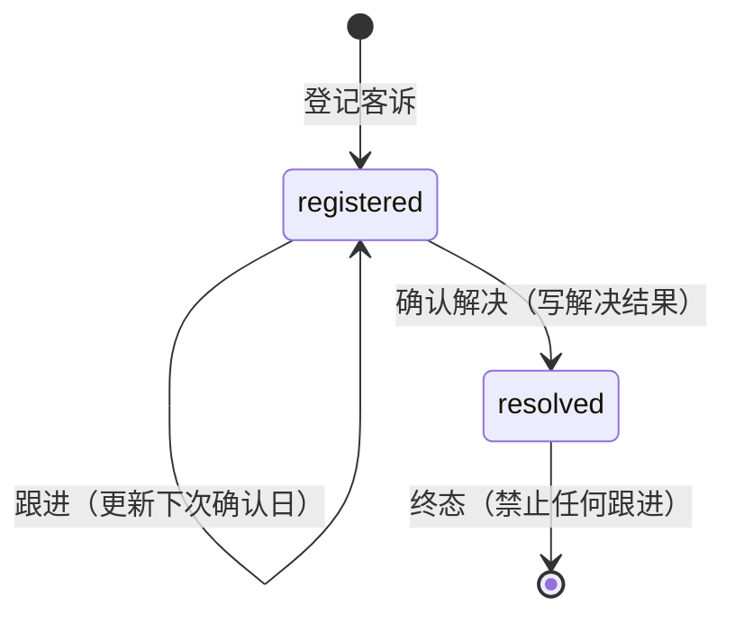
```mermaid
stateDiagram-v2
    [*] --> registered : 登记客诉
    registered --> registered : 跟进（更新下次确认日）
    registered --> resolved : 确认解决（写解决结果）
    resolved --> [*] : 终态（禁止任何跟进）
```

#### 时序图（登记 + 跟进/解决）

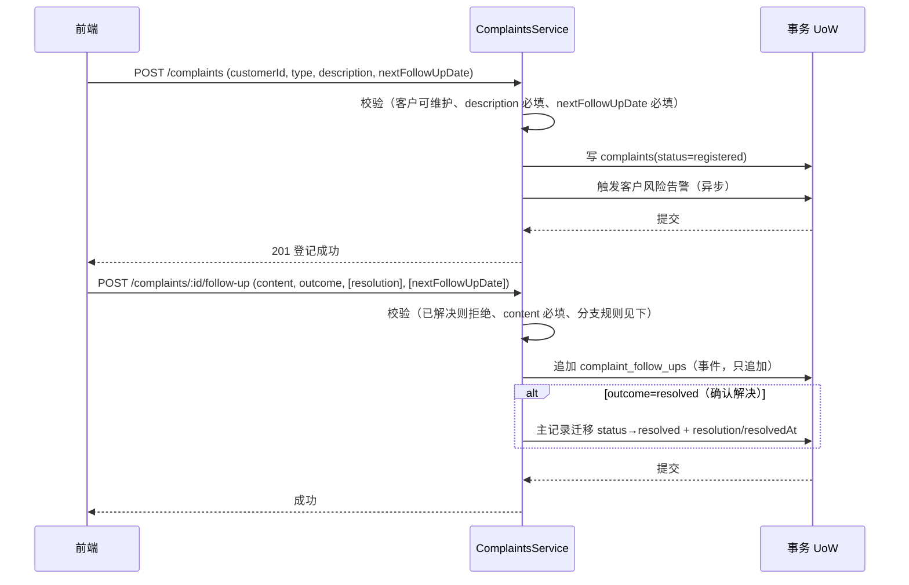
```mermaid
sequenceDiagram
    participant C as 前端
    participant S as ComplaintsService
    participant D as 事务 UoW
    C->>S: POST /complaints (customerId, type, description, nextFollowUpDate)
    S->>S: 校验（客户可维护、description 必填、nextFollowUpDate 必填）
    S->>D: 写 complaints(status=registered)
    S->>D: 触发客户风险告警（异步）
    D-->>S: 提交
    S-->>C: 201 登记成功
    C->>S: POST /complaints/:id/follow-up (content, outcome, [resolution], [nextFollowUpDate])
    S->>S: 校验（已解决则拒绝、content 必填、分支规则见下）
    S->>D: 追加 complaint_follow_ups（事件，只追加）
    alt outcome=resolved（确认解决）
        S->>D: 主记录迁移 status→resolved + resolution/resolvedAt
    end
    D-->>S: 提交
    S-->>C: 成功
```

#### 图外规则

| 规则           | 内容                                                                |
| -------------- | ------------------------------------------------------------------- |
| 权限           | 客户可维护（owner/管理链/admin）                                    |
| 登记           | description 必填、nextFollowUpDate 必填、触发客户风险告警           |
| 跟进           | content 必填；FOLLOWED_UP → 必填下次确认日；RESOLVED → 必填解决结果 |
| 状态机单向终态 | RESOLVED 禁止任何跟进（后端拦截 + 前端置灰）                        |
| 事件           | complaint_follow_ups 只追加（历史回溯）                             |
| 状态单一事实源 | complaints.status（跟进事件不覆盖主状态）                           |
| 逾期           | 派生（nextFollowUpDate < 今天 且未解决）→ 风险看板，非状态          |
| 重开           | 不开放——解决后再有问题 = 新建客诉                                   |
| 数据模型       | complaints + complaint_follow_ups（快照语义已定）                   |

#### 与已设计衔接

- 8.3 释放：有未解决客诉 → 禁止释放（先处理）——即本闭环的「解决」操作
- 8.9 风险看板：未解决客诉（status=registered）→ 风险聚合

### 8.7 周计划与指导意见

#### ① 周计划（销售按周排计划项）

```mermaid
sequenceDiagram
    participant C as 前端
    participant S as PlanningService
    C->>S: GET /plans?businessWeekId=xx
    S-->>C: 周计划 + 计划项（含拜访自动生成的）
    C->>S: POST /plans/:id/items (plannedDate, customerId?, action)
    S->>S: 校验（本人周计划、日期在业务周内）
    S-->>C: 计划项已添加
```

#### ② 指导意见（管理者 → 被指导者）

```mermaid
sequenceDiagram
    participant M as 管理者
    participant S as PlanningService
    participant C as 被指导者前端
    M->>S: POST /comments (targetType, targetId, content)
    S->>S: 校验（对下属目标、content 必填）
    S-->>M: 意见已发布
    S->>C: 通知被指导者（红点）
    C->>S: GET /comments/unread
    S-->>C: 未读意见数（红点角标）
    C->>S: POST /comments/:id/read
    S-->>C: 已读（红点消失）
```

#### 图外规则

| 规则       | 内容                                                                                                                   |
| ---------- | ---------------------------------------------------------------------------------------------------------------------- |
| 业务周     | 13 周窗口（近 4 + 未来 8），company-wide，管理员配置                                                                   |
| 周计划     | owner + business_week 唯一                                                                                             |
| 计划项     | plannedDate 在业务周内；customerId 可空（同行关系维护）；action 必填                                                   |
| 联动       | 拜访「下次拜访」→ 自动生成计划项（8.4 强一致，同事务）                                                                 |
| 指导意见   | targetType 多态（weekly_plan/weekly_plan_item/visit）；author 须为被指导者的上级（管理链）；read_at 已读闭环；红点提示 |
| 执行对比   | 周览显示计划 + 实际（分列展示，不精确配对——8.4 已定）                                                                  |
| 计划项定位 | 自我提醒清单（8.3 已定，非待办追踪器）                                                                                 |

#### 与已设计衔接

- 8.4 拜访登记：下次拜访 → 同事务生成计划项（本节的计划项来源之一）
- 8.3 释放：未来计划项作废（人的执行计划，不随客户）

### 8.8 费用（轻量统计）

#### 时序图（记录 / 提交 / 作废）

```mermaid
sequenceDiagram
    participant C as 前端
    participant S as ExpensesService
    C->>S: POST /expenses (expenseDate, 分项金额, notes)
    S->>S: 校验（本人、金额非负）
    S->>S: upsert（每人每天一条，同天更新）
    S-->>C: 保存
    C->>S: POST /expenses/:id/submit
    S->>S: 校验（draft 才可提交）
    S-->>C: 已提交（计入统计）
    C->>S: POST /expenses/:id/void
    S->>S: 校验（可作废）
    S-->>C: 已作废（剔除统计，留痕）
```

#### 图外规则

| 规则                     | 内容                                                                                   |
| ------------------------ | -------------------------------------------------------------------------------------- |
| 轻量定位                 | 费用统计工具，**非报销系统**（无审批/凭证/单据）                                       |
| 三态                     | draft（不计入）/ submitted（计入统计）/ voided（剔除留痕）                             |
| 唯一                     | 每人每天一条（owner + expense_date）                                                   |
| 分项                     | 烟酒/礼品/餐叙/招待/住宿 五类金额                                                      |
| 汇总                     | 个人按日、团队按月（reporting 聚合）                                                   |
| **预算参考（衍生价值）** | 费用趋势视图（按人/月/分项）→ 预算制定依据；**预算额度不建模**（权威在财务，防反模式） |
| 凭证                     | **不上传**（非报销，零文件存储）                                                       |
| 数据模型                 | **零变更**（daily_expenses 现有字段足够）                                              |

### 8.9 看板（只读聚合，reporting 域）

#### 看板聚合架构

```mermaid
flowchart LR
    O[opportunities/deals] --> R[reporting 聚合查询]
    V[visit_records/weekly_plans] --> R
    C[complaints] --> R
    E[daily_expenses] --> R
    R --> Y[经营看板: 漏斗/储备/转化]
    R --> W[团队执行看板]
    R --> F[客户风险看板]
    R --> X[团队费用]
```

#### 各看板设计

| 看板          | 数据源                                               | 核心指标                       | 权限                       |
| ------------- | ---------------------------------------------------- | ------------------------------ | -------------------------- |
| 经营看板·漏斗 | opportunities（stage/amount/product_line）           | 各阶段数量/金额分布            | executive（方案 A 专属）   |
| 经营看板·储备 | opportunities（expected_close_date）                 | 未来 N 月滚动意向金额          | executive                  |
| 经营看板·转化 | opportunity_events + close_reason                    | 阶段转化率、丢失归因分布       | executive                  |
| 团队执行      | weekly_plan_items + visit_records                    | 计划 vs 实际（分列）、成员对比 | 管理者（组织树 team 范围） |
| 团队费用      | daily_expenses                                       | 按月、按成员/分项汇总          | 管理者                     |
| 客户风险      | complaints（未解决+逾期）+ opportunities（逾期跟进） | 逾期排序、地域/等级/新老筛选   | 管理者                     |

#### 关键规则

| 规则          | 内容                                                                |
| ------------- | ------------------------------------------------------------------- |
| 只读聚合      | 看板不写业务数据（reporting 纯查询）                                |
| 权限          | 经营看板=executive 专属；团队类=管理者（组织树范围）；个人看板=自己 |
| 指标口径      | 执行类按业务周、经营/费用按自然月（红线 10，口径分离）              |
| 逾期判定      | 派生：next_follow_up_date 过期（客诉未解决/商机未跟进）——非状态     |
| 漏斗金额      | 意向金额（预测口径）——成交用实际（口径分离）                        |
| 数据基础      | 全部基于现有表聚合，零模型变更                                      |
| AI 衔接（M8） | 经营三件套（漏斗/储备/转化）是 AI insight 的确定性底座              |

#### 与已设计衔接

- 8.5 商机（漏斗/储备/转化数据源）· 8.6 客诉（风险看板数据源）· 8.8 费用（团队费用数据源）· 8.4/8.7 周计划（团队执行数据源）

### 8.10 提醒与审计

#### 提醒域（三面：待办融入 / 事件通知 / 管理监控）

| 功能                | 接收者 | 承载                                         | 价值             |
| ------------------- | ------ | -------------------------------------------- | ---------------- |
| 待办（融入日 card） | 销售   | 日 card 聚合：今天计划项 + 客诉/商机跟进到期 | 该做的，少而精   |
| 事件通知            | 所有人 | 审批结果 / 指导意见红点                      | 流程事件         |
| 管理监控            | 管理层 | 大客户（S/A）风险 + 大商机风险               | 丢不起/等不起    |
| 结构分析            | 管理层 | 经营分析视图（半年未成交/客户结构/团队健康） | 低频参考，不提醒 |

#### 时序图（事件通知 + 定时扫描）

```mermaid
sequenceDiagram
    participant B as 业务动作
    participant A as AlertsService
    participant R as 接收人
    B->>A: 事件触发（客诉/接管审批/指导意见）
    A->>R: 通知（事件类）
    Note over A: 定时扫描（每日）
    A->>A: 大客户/大商机风险扫描
    A->>R: 管理监控（管理层视角）
```

#### 审计

```mermaid
sequenceDiagram
    participant U as 用户操作
    participant S as 业务服务
    participant A as AuditService
    U->>S: 写操作（创建/编辑/移交/作废/审批...）
    S->>A: 记录审计（actor/action/entityType+entityId/before/after）
    A->>A: append-only（不可改不可删）
```

#### 图外规则

| 规则     | 内容                                                             |
| -------- | ---------------------------------------------------------------- |
| 待办     | 融入日 card（不独立功能）：今天计划项 + 客诉/商机跟进到期        |
| 事件通知 | 事件触发（客诉/审批/指导意见），未读角标                         |
| 管理监控 | 大客户（S/A）客诉未解决/逾期/停滞 + 大商机（金额阈值）风险——盯防 |
| 结构分析 | 半年未成交/客户结构/团队健康 → 经营分析视图（低频，不提醒）      |
| 审计     | 关键写操作 + before/after 快照，append-only，业务回溯（红线 14） |
| 数据模型 | alerts + audit_logs（已有，零变更）                              |

#### 与已设计衔接

- 8.3 接管：申请/审批 → 事件通知（已设计）· 8.6 客诉：登记 → 风险事件 · 8.7 指导意见：红点已读闭环 · 8.9 看板：结构分析承载

## 九、集成与部署

> 架构模式：标准 Web 部署——Nginx（反向代理 + 静态资源 + HTTPS 终结）+ 应用服务（PM2 守护）+ 关系型数据库（PG）。

### 9.1 钉钉集成（M1 抽象 / M6 实现）

- **auth provider 抽象**：password（桌面/移动浏览器）+ dingtalk（钉钉内）；前端按 UA 检测钉钉环境决定登录方式
- **免登流程**：钉钉内 H5 → `dd.getAuthCode` → 后端调钉钉开放平台换身份（手机号/工号）→ 匹配 users 表 → 签发本系统 JWT
- **schema**：users.phone；登录双通道 `POST /auth/login` 与 `POST /auth/dingtalk`
- **前提**：域名完成 ICP 备案 + HTTPS（备案待办，1-2 周流程）

### 9.2 部署架构

```
腾讯云 Linux 服务器（单台 2C4G）
├── Nginx            # 唯一对外入口（443 HTTPS）+ 双端静态资源 + /api 反向代理 + UA 分流
├── Node 服务        # NestJS，PM2 守护（127.0.0.1:3001）
└── PostgreSQL 16    # 本机监听 127.0.0.1（不对外）
```

| 决策点   | 方案                                                               |
| -------- | ------------------------------------------------------------------ |
| 单机     | 每日 pg_dump 备份（RPO≈1天/RTO≈几小时）                            |
| 双端部署 | web/mobile 静态产物由 Nginx 直接服务，更新零停机                   |
| 迁移执行 | 发布脚本显式执行（备份 → migrate → pm2 restart），非应用启动副作用 |
| 配置     | 生产 .env 存服务器不入 git；仓库只提交 .env.example                |
| HTTPS    | Nginx 终结；腾讯云免费证书或 Let''s Encrypt                        |
| 备份     | 每日 pg_dump + 保留策略 + 异地副本；至少一次恢复演练               |
| 安全边界 | 防火墙只开 443/22；PG 只监听本机；生产关闭调试                     |
| 日志     | NestJS 日志落盘 + Nginx log + logrotate 轮转                       |
| 发布流程 | 单人脚本：git pull → 备份 → build → migrate → pm2 restart          |
| 双端分流 | Nginx 层 UA 判断 302，零前端代码                                   |

- **PM2 配置**：`pm2 start apps/api/dist/main.js --name crm-api --env production`；`pm2 save` + `pm2 startup` 开机自启；日志走 pm2 logs

### 9.3 本地开发环境

- 数据库：本地开发两种方案——Docker（`docker compose` 提供 PostgreSQL 16 + pg_trgm 扩展）或本机已装 PG（建用户/建库/建扩展三步见 `docs/M0-工程骨架说明.md` 步 9，注意三条命令分开执行）；生产用部署机原生 PG
- 连接参数经 `.env` 注入（不入 git），配置模板提交 `.env.example`

---

## 十、开发与工程

> 契约模式：Contract-First（OpenAPI 契约优先）——契约是生成物，后端 DTO 为唯一事实源。

### 10.1 工程流程（单人 + 异地办公）

- 代码同步：git + GitHub 私有仓库；主干开发（main 直推，小改动小提交）
- 工程护栏：根 .gitignore（node_modules/dist/coverage/.env*/*.local）+ Node 版本约束（engines ≥ 20.19 或 22+，配 .nvmrc）
- 换机器可跑：提交 pnpm-lock.yaml + .env.example + README《环境准备清单》
- CI：GitHub Actions 自 M0 启用（install → lint → typecheck → test → build → 契约无 diff），与本地门禁 husky + lint-staged 并行
- 数据备份：定时 pg_dump
- 测试基线：**统一 Vitest（API 不用 Jest——避免 jest-resolve→unrs-resolver 原生构建脚本；NestJS 用 Vitest + supertest）** + 后端单测（验重/分级容量/接管审批链/费用作废/周计划联动）+ 主链路 e2e（登录→建客户→拜访→商机→成交）+ 前端表单组件与看板逻辑单测 + 数据库测试打真 SQL

### 10.2 开发原则（Coding Principles）

1. **单一职责原则（SRP）**：每个文件/模块只承担一个职责；单文件 ≤ 400 行，超出按职责拆分——杜绝上帝对象（God Object / God Class）
2. **关注点分离（SoC）与模块化（Modularity）**：按架构层（表现/应用/领域/基础设施）与业务域组织，高内聚低耦合，模块间经显式接口协作
3. **依赖方向（Dependency Rule）**：依赖单向（表现层 → 应用层 → 领域层 ← 基础设施层）；禁止反向依赖与循环依赖

### 10.3 编码红线

| #   | 约束                                                                                                  |
| --- | ----------------------------------------------------------------------------------------------------- |
| 1   | HTTP 客户端全项目同源，禁止复制实现；传输层唯一，禁直接 fetch                                         |
| 2   | URL 与请求体按业务域收敛，禁止散落页面                                                                |
| 3   | 抽象层级匹配团队规模，避免过度设计                                                                    |
| 4   | 命名冲突用 import 别名                                                                                |
| 5   | 类型单源：契约类型唯一来源，禁止重复声明                                                              |
| 6   | 权限服务端收口，搜索不能绕开范围                                                                      |
| 7   | UUID 与文本字段不能混比（Drizzle 类型约束）                                                           |
| 8   | 「事件」与「当前状态」同时保存（事件表 + 主表状态）                                                   |
| 9   | 日期区分事实日期（occurredAt）与计划日期（nextFollowUpDate）                                          |
| 10  | 业务周是业务口径，不是自然周替代品                                                                    |
| 11  | 前端状态更新不能依赖刷新（reload/setData）                                                            |
| 12  | 可复用业务表单必须同源                                                                                |
| 13  | 开发端口占用≠程序故障（health 检查）                                                                  |
| 14  | 审计日志用于业务回溯，不等于数据版本库                                                                |
| 15  | 移动端优先保证操作闭环                                                                                |
| 16  | 移动端适配禁止手工断点 CSS，样式只走 design-tokens                                                    |
| 17  | 禁止超大单体文件（单文件 ≤ 400 行，超出按职责拆分）——老项目 VisitsPage 2410 行的教训                  | 前端组件/页面、后端 service/controller 通用约束 |
| 18  | 依赖构建脚本审批（pnpm ≥10）：未经 allowBuilds 放行的包禁止执行构建脚本；放行仅限确需运行才能工作的包 | 供应链安全                                      |

### 10.4 构建脚本审批策略（pnpm 11）

- pnpm ≥ 10 默认忽略依赖构建脚本（供应链安全）；被忽略的包自动写入 `pnpm-workspace.yaml` 的 `allowBuilds` 占位（`set this to true or false`），需人工判定后 `pnpm approve-builds` 或手改
- **测试统一 Vitest 后 API 不依赖 jest-resolve，`unrs-resolver` 不再出现**；`allowBuilds` 仅放行确需构建脚本的包（如原生 NAPI 绑定），其余一律 `false`
- 判定标准：包带 postinstall 且不运行会影响运行时正确性才放行；不确定的一律不放行

---

## 十一、里程碑 M0–M9

| 里程碑        | 内容                                                                                                                                | 验证标准                                                                         |
| ------------- | ----------------------------------------------------------------------------------------------------------------------------------- | -------------------------------------------------------------------------------- |
| M0 工程地基   | monorepo 骨架（web/mobile/domain/contracts/api）；契约 codegen；Drizzle schema+迁移（全量 22 表）；GitHub Actions CI；design-tokens | pnpm dev 一键起；CI 全绿（lint/type/test/build/契约无diff）                      |
| M1 身份组织   | auth（password+dingtalk 抽象）+ org + 权限服务 + audit                                                                              | 登录/权限语义正确；权限服务单测绿                                                |
| M2 客户域     | customers + catalog + claims + 查重检索 + 分级容量                                                                                  | 验重/分级容量/接管审批链单测绿；双端列表详情可用；查重提示疑似、检索五级排序可用 |
| M3 业务动作域 | activities + opportunities + complaints（★移动端填报主场景）                                                                        | 主链路 e2e：登录→建客户→拜访→商机推进→成交；移动端填报表单单测绿                 |
| M4 计划费用域 | planning + expenses                                                                                                                 | 周计划联动、费用作废不改总额 单测绿                                              |
| M5 管理视图域 | team + alerts + 风险看板                                                                                                            | 权限范围内聚合正确；风险看板移动端卡片可用                                       |
| M6 钉钉与打磨 | 钉钉免登、管理看板（P2 起步）、Excel 导出、移动真机、性能、文档                                                                     | 钉钉内免登可用；导出格式与旧版一致                                               |
| M7 数据迁移   | 旧库 ETL 导入 + 对账（功能验证通过后执行）                                                                                          | 对账清单全绿（客户/商机/Deal/客诉/费用）                                         |
| M8 AI insight | reporting 确定性指标 → 看板智能解读/预警/建议                                                                                       | 解读基于确定性指标、口径一致；无 AI 时看板不受影响                               |
| M9 AI intake  | 移动端「记一笔」语音/文字 → 草稿 → 人工确认 → 落库                                                                                  | 语音录入→确认→落库主链路可用；草稿拒绝留痕                                       |

节奏要点：每里程碑结束可上 staging 真机验证；M2+M3 完成双端核心闭环（P0/P1）；钉钉与看板后置于 M6；数据迁移 M7 独立收尾；AI 阶段 M8-M9 完全后置（M0-M7 只留 schema 与模块位）。

---

_技术规格。新增决策与约束请追加至对应章节。_
